# Latex+TexLive+VSCode环境配置

## 1. 安装TexLive

### 1.1 下载

TexLive官网：https://www.tug.org/texlive/

TexLive下载地址：https://mirrors.tuna.tsinghua.edu.cn/CTAN/systems/texlive/Images/

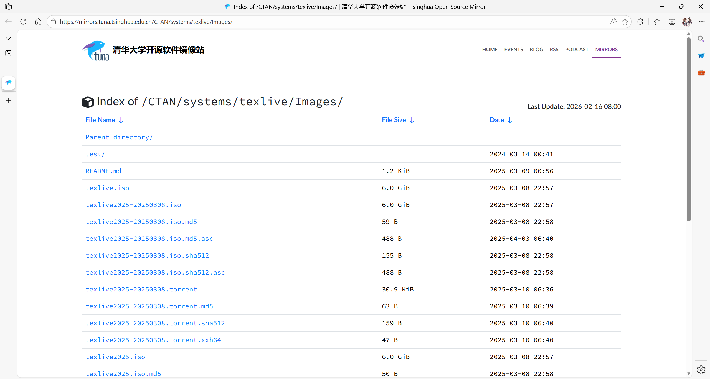

下载textlive.iso后打开镜像。

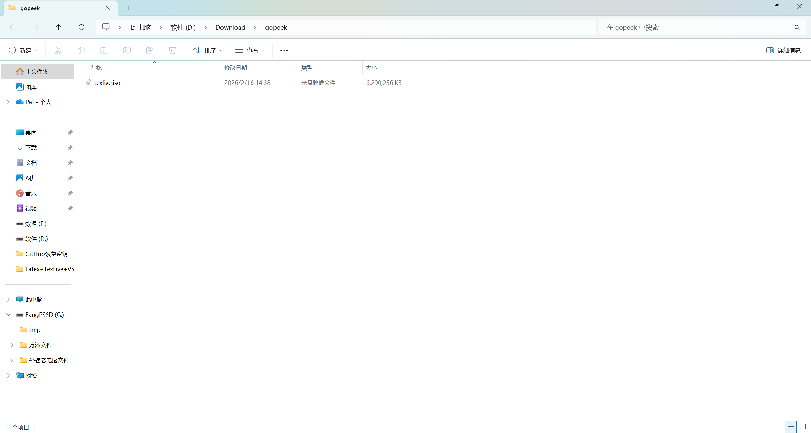

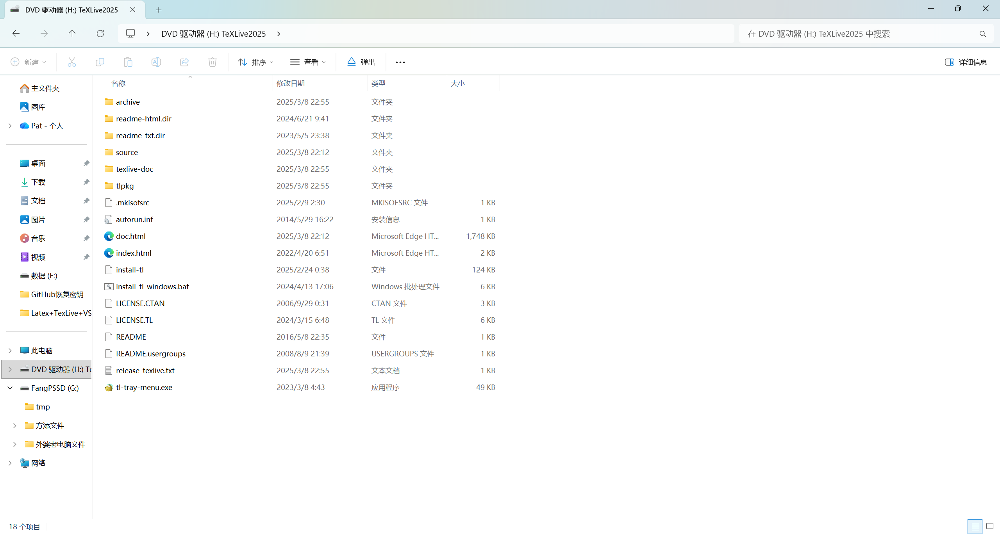

### 1.2 安装

打开其中的install-tl-windows.bat

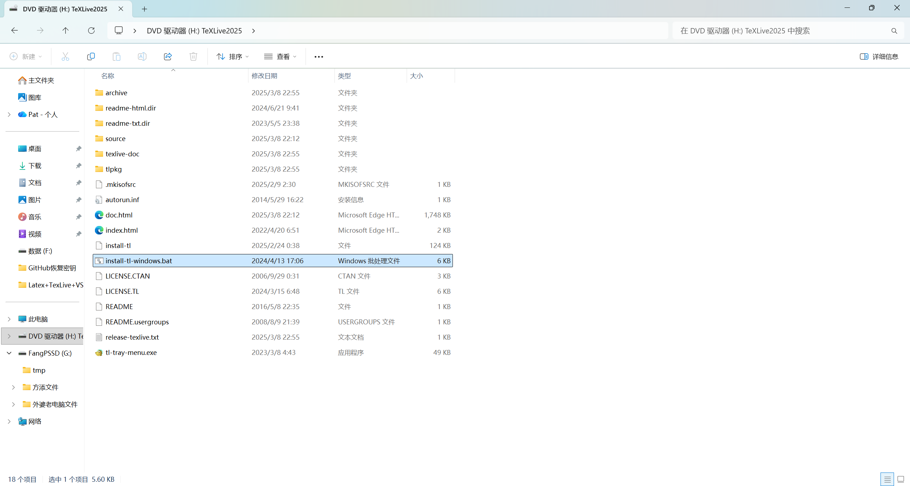

进行相应设置

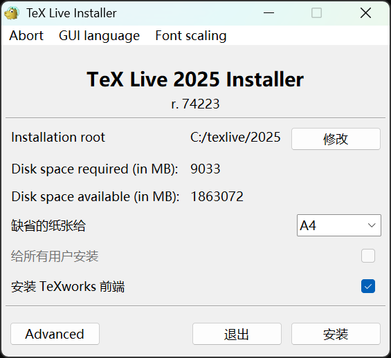

完成后点击关闭

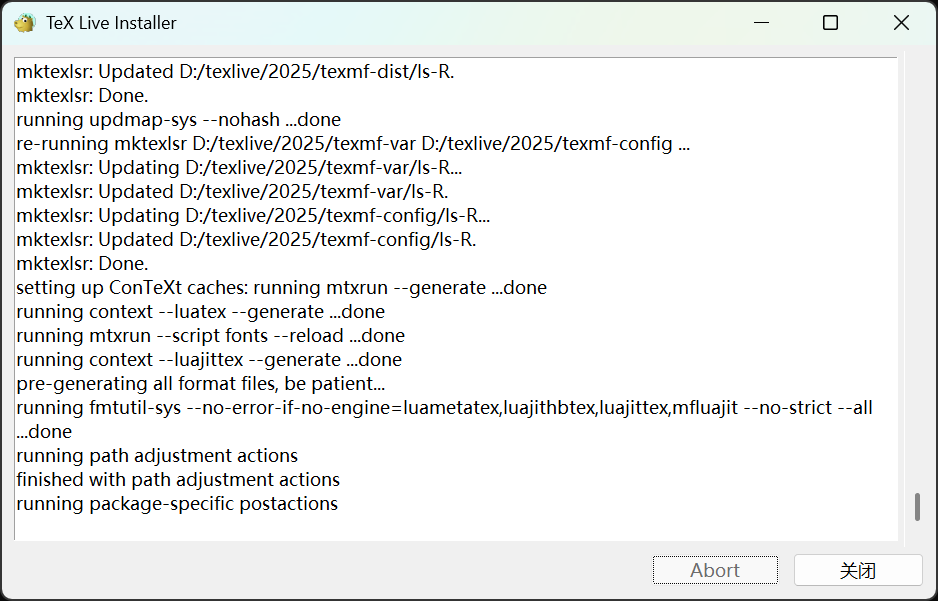

## 2. 安装VSCode并配置

VSCode官网：https://code.visualstudio.com/

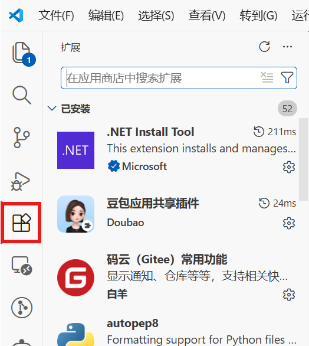

打开扩展，搜索latex worrkshop，安装

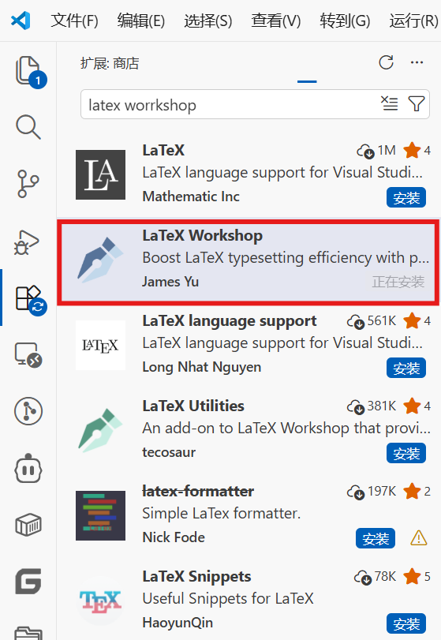

## 3. 配置VSCode

### 3.1 自动保存

打开VSCode，点击左下角设置

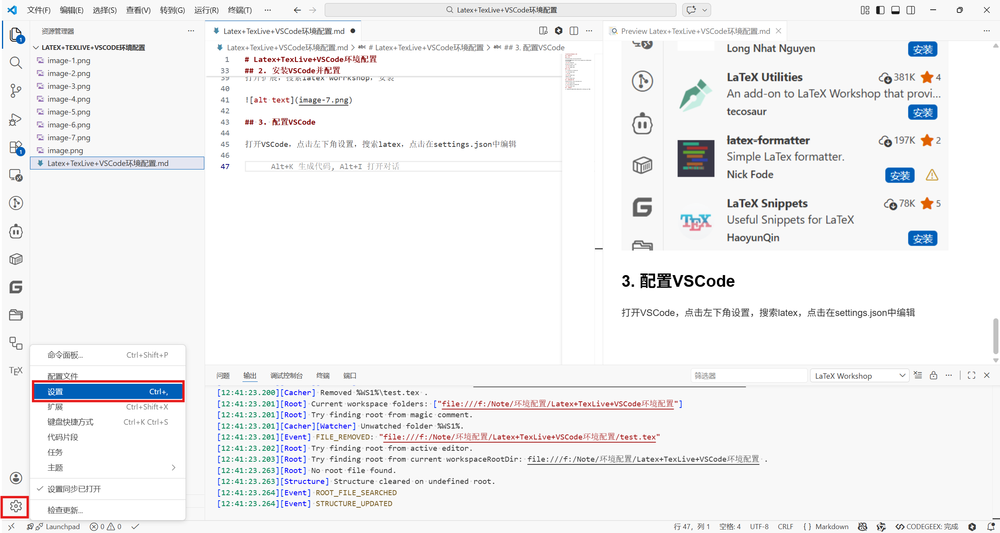

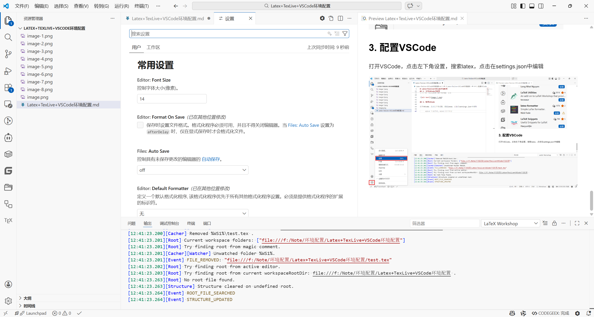

搜索auto save，设置为afterDelay

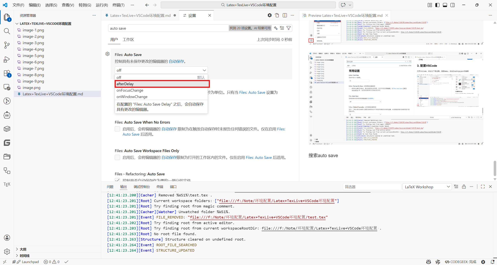

在下面的框里设置自动保存延迟时间（单位为毫秒），一般设置为1000即可

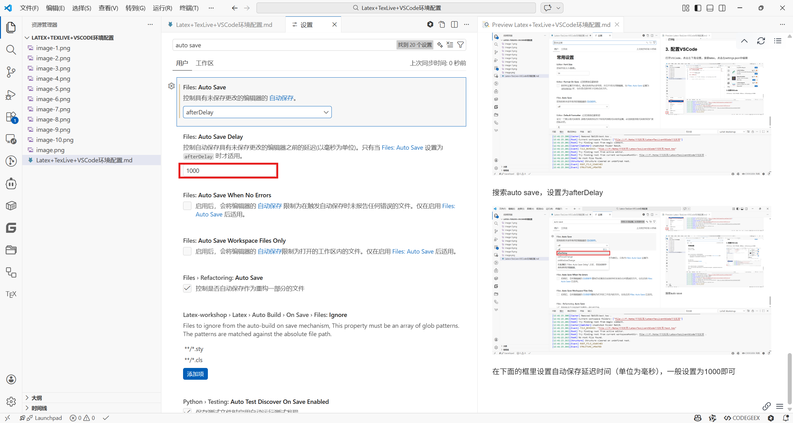

### 3.2 自动编译

搜索auto build，设置为onSave

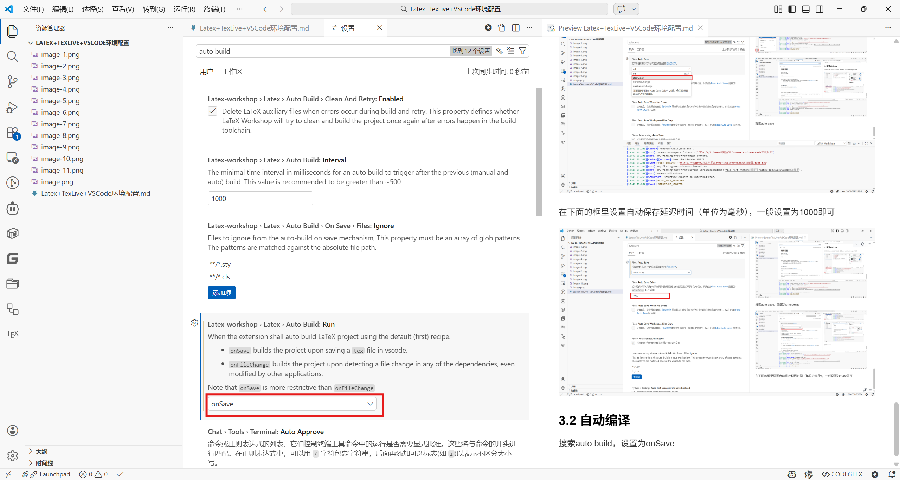

这样就可以在保存时自动编译，所以按下`Ctrl+S`可以实现保存加编译

### 3.3 设置默认编译器

打开设置

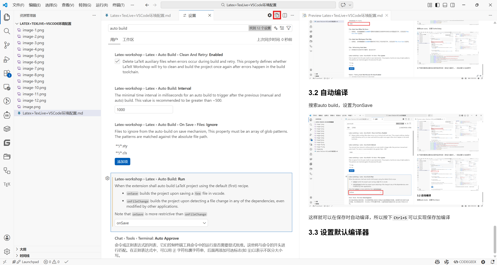

进入json配置文件

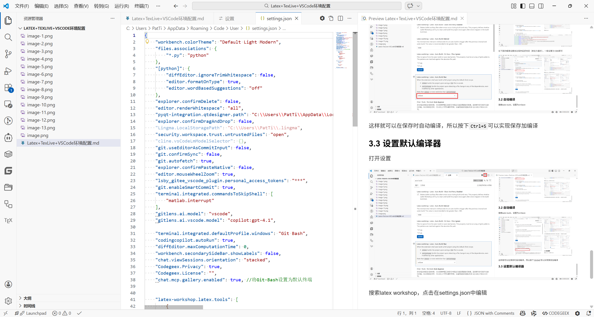

按下`Ctrl+F`搜索,latex-workshop.latex.tools

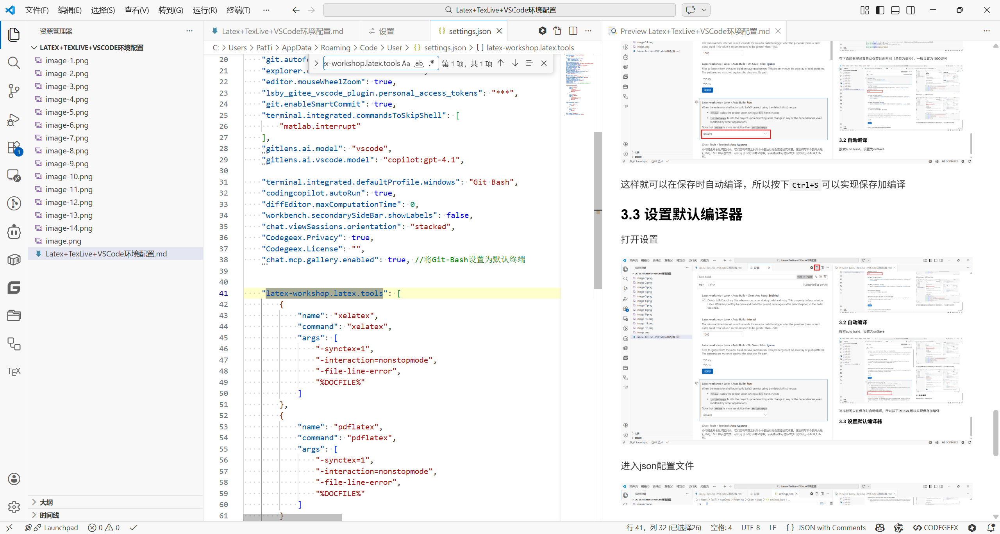

替换内容如下：

```json

"latex-workshop.latex.tools": [
    {
        // 设置默认编译器
        "name": "xelatex",
        // 编译命令
        "command": "xelatex",
        // 编译参数
        "args": [
            "-xelatex", // 使用xelatex编译
            "-synctex=1", // 使用synctex,允许在pdf中点击跳转到对应的tex文件
            "-interaction=nonstopmode", // 非交互模式
            "-file-line-error", // 显示错误行
            "%DOC%" // 文档路径，%DOC%是默认参数，表示当前编译的文档
        ],
        "env": {}
    },
]

```

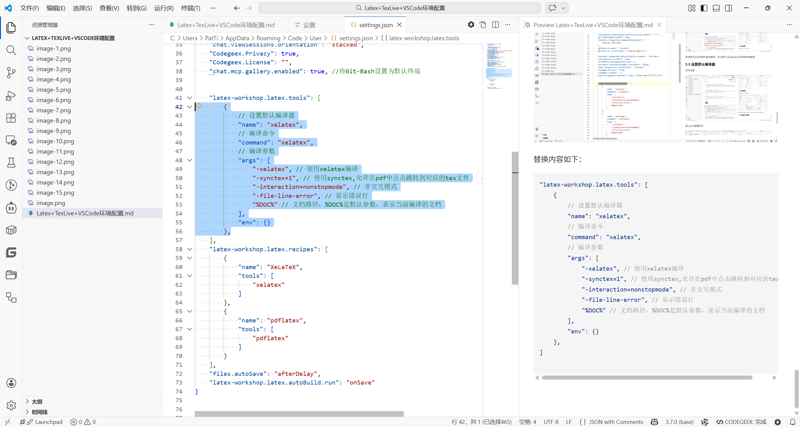

### 3.4 设置输出路径

Latex编译会产生许多临时文件，为了避免这些文件占用空间，保持文件的整洁有序，可以设置输出路径。

首先在`latex-workshop.latex.tools`前一行添加如下内容：

```json
"latex-workshop.latex.outDir": "./build",
```
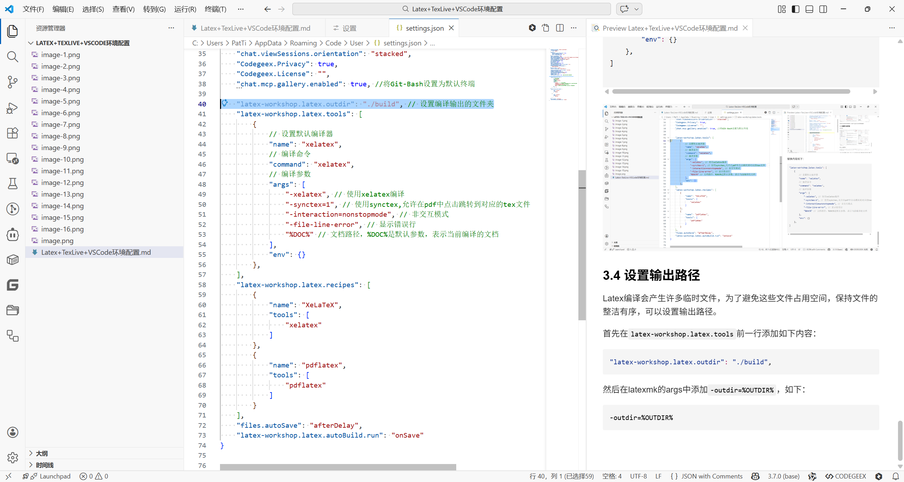

然后在latexmk的args中添加`-output-directory=%OUTDIR%`，如下：

```json
-output-directory=%OUTDIR%
```

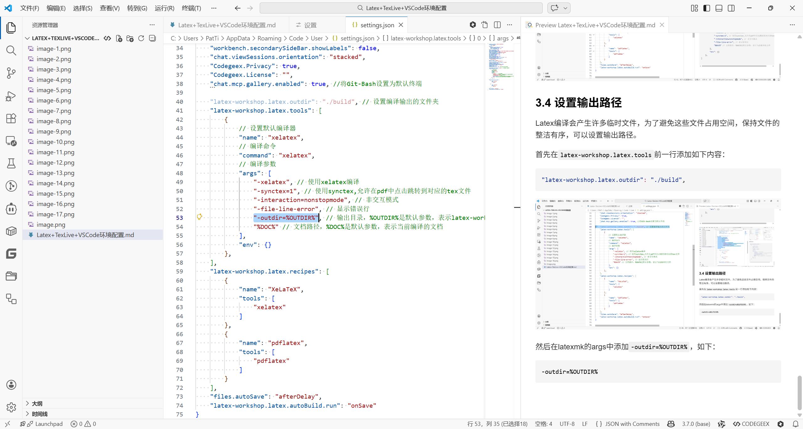

### 3.5 个人配置

笔者个人习惯PDF生成在tex同一目录下，其他编译的辅助文件（如.aux、.log、.synctex.gz等）生成在build文件夹中，目录结构如下：

```
00-Latex语法/
├── Latex语法.tex          # 源文件
├── Latex语法.pdf          # PDF文件
├── build/
│   ├── Latex语法.aux      # 辅助文件
│   ├── Latex语法.log      # 辅助文件
│   ├── Latex语法.synctex.gz
│   └── Latex语法.pdf      # 原始PDF（可忽略）
```
因为LaTeX编译器默认将所有输出文件放在同一目录,所以需要结合编译后处理来实现。

使用recipes配置，在编译后自动将PDF复制到源目录，最终的配置文件如下：

```json

    "latex-workshop.latex.outDir": "./build",
    "latex-workshop.latex.tools": [
        {
            // 设置默认编译器
            "name": "xelatex",
            // 编译命令
            "command": "xelatex",
            // 编译参数
            "args": [
                "-xelatex", // 使用xelatex编译
                "-synctex=1", // 使用synctex,允许在pdf中点击跳转到对应的tex文件
                "-interaction=nonstopmode", // 非交互模式
                "-file-line-error", // 显示错误行
                "-output-directory=%OUTDIR%", // 输出目录
                "%DOC%" // 文档路径
            ],
            "env": {}
        },
        {
            "name": "pdflatex",
            "command": "pdflatex",
            "args": [
                "-synctex=1",
                "-interaction=nonstopmode",
                "-file-line-error",
                "-output-directory=%OUTDIR%",
                "%DOC%"
            ],
            "env": {}
        },
        {
            "name": "copy-pdf",
            "command": "powershell",
            "args": [
                "-Command",
                "Copy-Item",
                "-Path",
                "%DIR%/build/%DOCFILE%.pdf",
                "-Destination",
                "%DIR%/%DOCFILE%.pdf",
                "-Force"
            ],
            "env": {}
        }
    ],
    "latex-workshop.latex.recipes": [
        {
            "name": "xelatex + copy PDF",
            "tools": [
                "xelatex",
                "copy-pdf"
            ]
        },
        {
            "name": "XeLaTeX",
            "tools": [
                "xelatex"
            ]
        },
        {
            "name": "pdflatex",
            "tools": [
                "pdflatex"
            ]
        }
    ],
    "files.autoSave": "afterDelay",
    "latex-workshop.latex.autoBuild.run": "onSave"
    }
```


