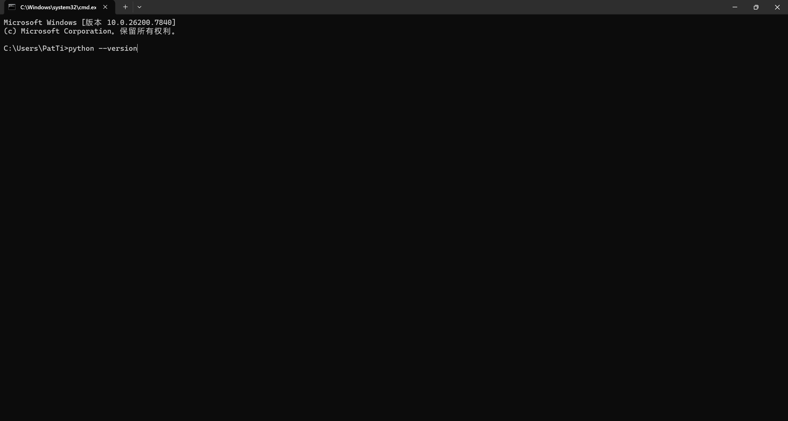
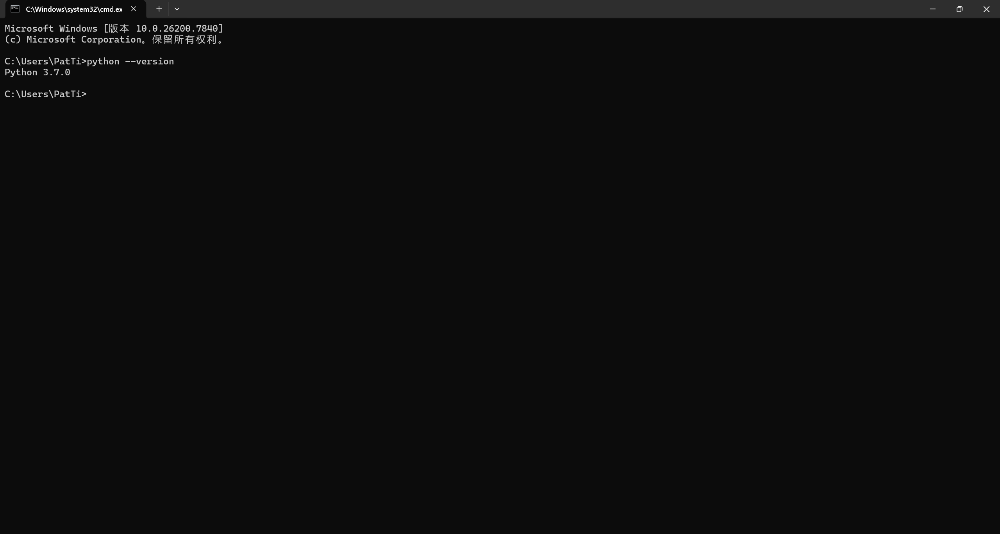
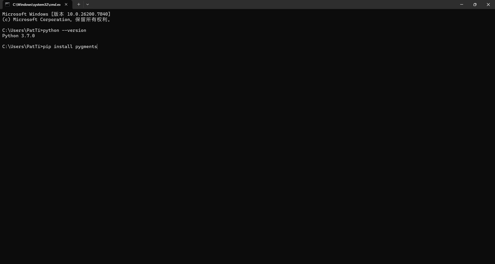
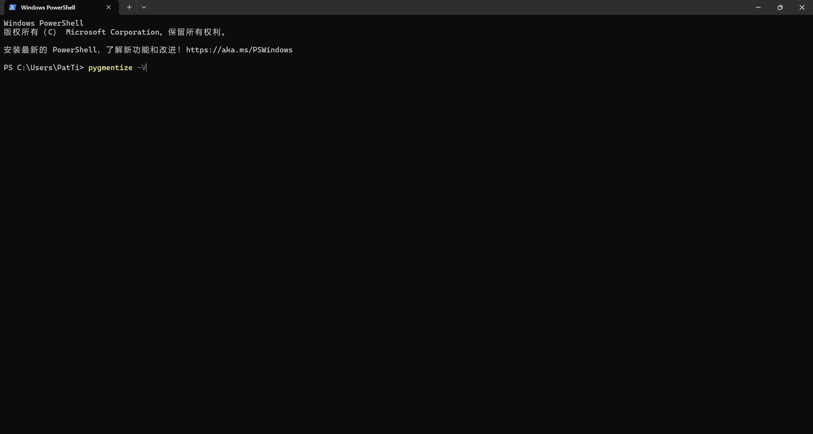
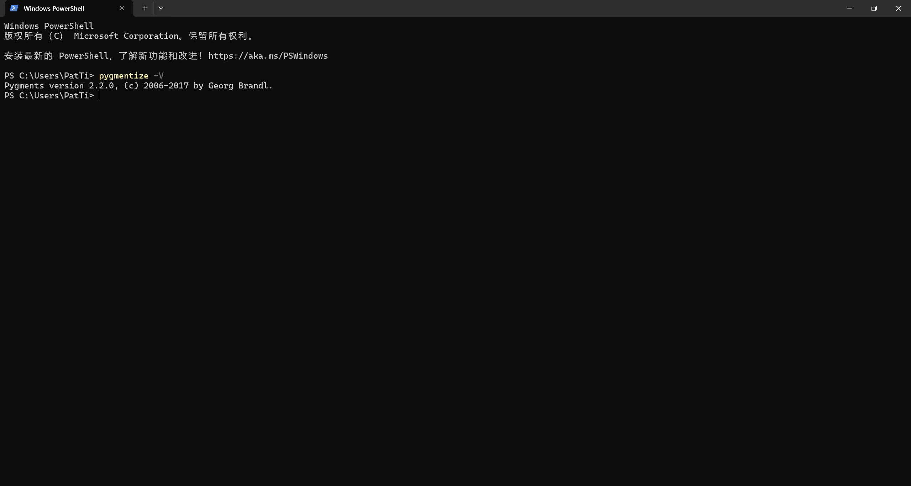
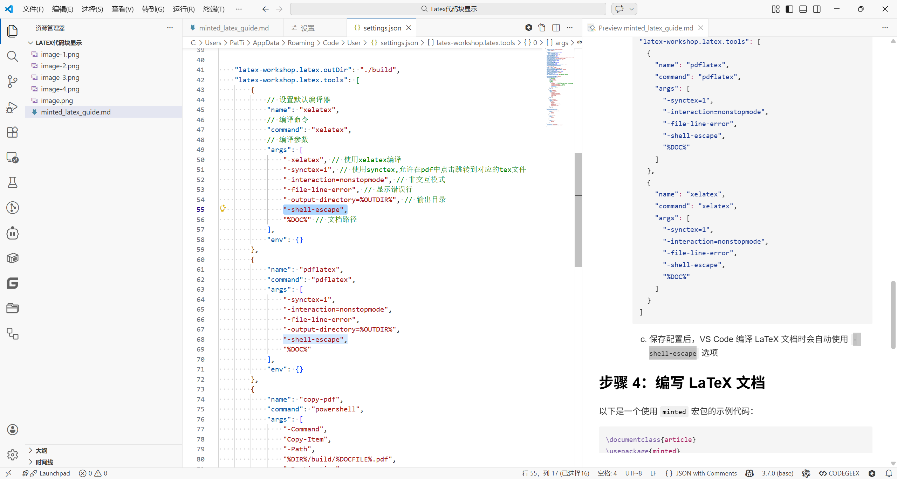
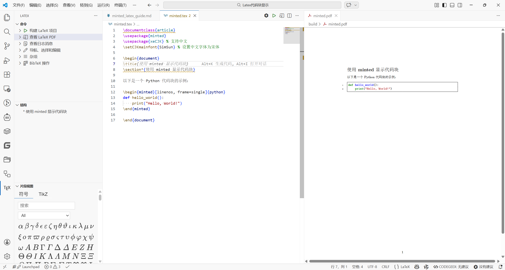

# 使用 minted 在 LaTeX 中显示代码块的完整教程

`minted` 是 LaTeX 中一个强大的宏包，用于高亮显示代码块。它基于 Python 的 `Pygments` 库，因此在使用 `minted` 之前，需要先配置好 Python 环境并安装相关依赖。

## 步骤 1：安装 Python 和 Pygments

1. **下载并安装 Python**
   - 前往 [Python 官方网站](https://www.python.org/) 下载适合您操作系统的 Python 安装包。
   - 安装时，务必勾选“Add Python to PATH”选项。

    如果不确定是否安装了Python，使用下面方法测试：
   - 在命令提示符（Windows）或终端（macOS/Linux）中输入以下命令：
     ```bash
     python --version
     ```
    

     如果成功安装，将看到类似以下的输出：
     ```
     Python 3.x.x
     ```
     


2. **安装 Pygments**
   - 打开命令提示符（Windows）或终端（macOS/Linux）。
   - 输入以下命令安装 Pygments：
     ```bash
     pip install pygments
     ```

     

   - 安装完成后，可以通过以下命令验证安装是否成功：
     ```bash
     pygmentize -V
     ```
     
     
     
     如果成功安装，您将看到类似以下的输出：

     ```
     Pygments version 2.x.x, (c) 2006-2026 by Georg Brandl.
     ```

     

## 步骤 2：安装 LaTeX 编辑器和编译器

1. **下载并安装 TeX 发行版**
   - 推荐使用 [TeX Live](https://www.tug.org/texlive/) 或 [MikTeX](https://miktex.org/)（适用于 Windows）。
   - 安装时，请确保选择了完整安装，或者至少包含 `minted` 宏包。

2. **安装支持的编辑器**
   - 推荐使用 [TeXstudio](https://www.texstudio.org/) 或 [Overleaf](https://www.overleaf.com/) 作为 LaTeX 编辑器。

## 步骤 3：配置 LaTeX 使用 `minted`

1. **启用 `-shell-escape` 选项**
   - `minted` 需要调用外部的 `pygmentize` 命令，因此需要启用 `-shell-escape` 选项。
   - 如果使用命令行编译：
     ```bash
     pdflatex -shell-escape yourfile.tex
     ```
   - 如果使用 VS Code（需要安装 LaTeX Workshop 插件）：
     1. 按 `Ctrl + ,` 打开设置，搜索 "latex workshop"
     2. 或者直接编辑 `settings.json`，添加以下配置：
     ```json
     "latex-workshop.latex.tools": [
       {
         "name": "pdflatex",
         "command": "pdflatex",
         "args": [
           "-synctex=1",
           "-interaction=nonstopmode",
           "-file-line-error",
           "-shell-escape",
           "%DOC%"
         ]
       },
       {
         "name": "xelatex",
         "command": "xelatex",
         "args": [
           "-synctex=1",
           "-interaction=nonstopmode",
           "-file-line-error",
           "-shell-escape",
           "%DOC%"
         ]
       }
     ]
     ```

     
     
     3. 保存配置后，VS Code 编译 LaTeX 文档时会自动使用 `-shell-escape` 选项

## 步骤 4：编写 LaTeX 文档

以下是一个使用 `minted` 宏包的示例代码：

```latex
\documentclass{article}
\usepackage{minted}

\begin{document}

\section*{使用 minted 显示代码块}

以下是一个 Python 代码块的示例：

\begin{minted}[linenos, frame=single]{python}
def hello_world():
    print("Hello, World!")
\end{minted}

\end{document}
```

### 代码解释
- `\usepackage{minted}`：引入 `minted` 宏包。
- `\begin{minted}[选项]{语言}`：开始一个代码块。
  - `linenos`：显示行号。
  - `frame=single`：为代码块添加单线边框。
  - `{python}`：指定代码块的语言为 Python。
- `\end{minted}`：结束代码块。

## 步骤 5：编译文档

1. 保存上述代码为 `minted.tex`。
2. 使用以下命令编译：
   ```bash
   pdflatex -shell-escape minted.tex
   ```
3. 如果使用VS Code，确保已启用 `-shell-escape` 选项，然后点击“编译”按钮。

编译成功



## 常见问题

1. **错误：`Package minted Error: You must have `pygmentize' installed to use this package.`**
   - 确保已正确安装 Python 和 Pygments，并且 `pygmentize` 命令可以在命令行中运行。

2. **错误：`! Package minted Error: Missing Pygments output; 
  
  please ensure that 
  
  -shell-escape is enabled.`**
   - 确保在编译时启用了 `-shell-escape` 选项。

3. **代码高亮不正确**
   - 确保在 `\begin{minted}` 中指定了正确的编程语言。

通过以上步骤，您应该能够成功使用 `minted` 宏包在 LaTeX 中高亮显示代码块。如果有其他问题，请随时提问！