# Ubuntu安装Claude Code CLI教程

按照下面的步骤操作，即可完成相同流程。

## 操作步骤

1）在桌面上右键，点击从终端中打开

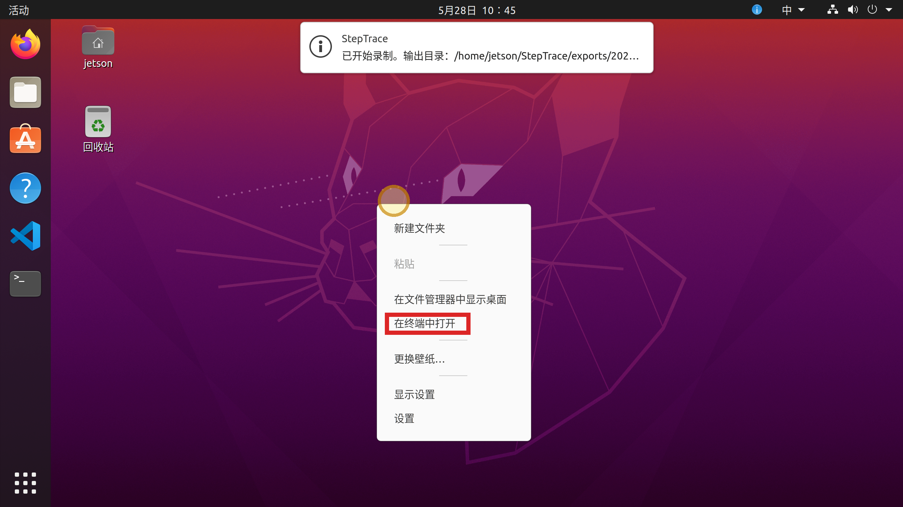

2）输入
```
sudo apt update && sudo apt upgrade -y
```
然后按下回车键，更新系统环境

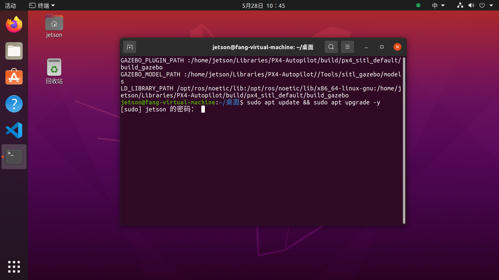

3）然后输入你的密码，按下回车键。

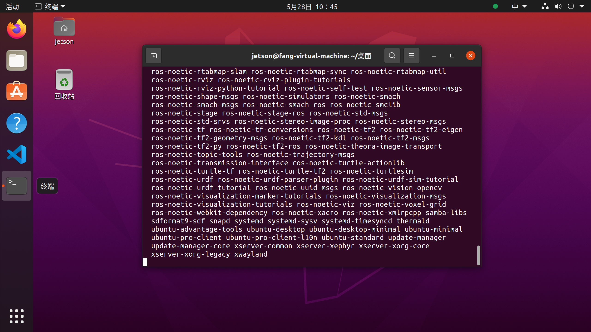

4）在当前界面中向上滚动。

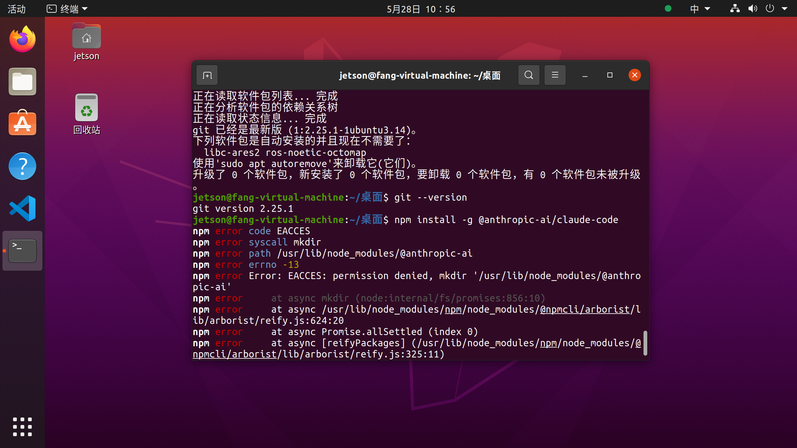

5）输入代码安装nvm，然后按下回车键。
```
curl -o- https://raw.githubusercontent.com/nvm-sh/nvm/v0.39.7/install.sh | bash
```

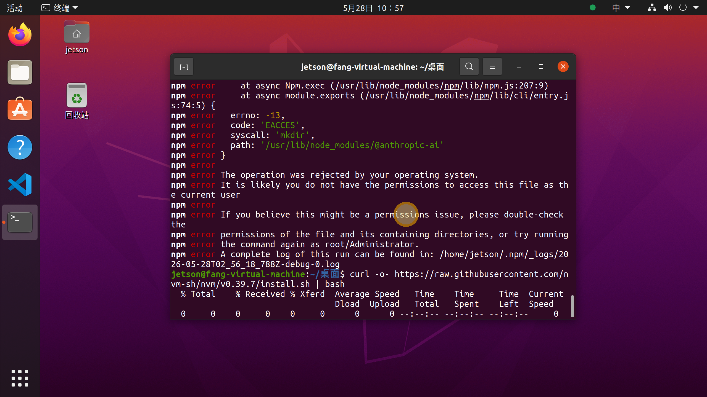

6）输入指令，重新加载 shell 配置，然后按下回车键。
```
source ~/.bashrc
```

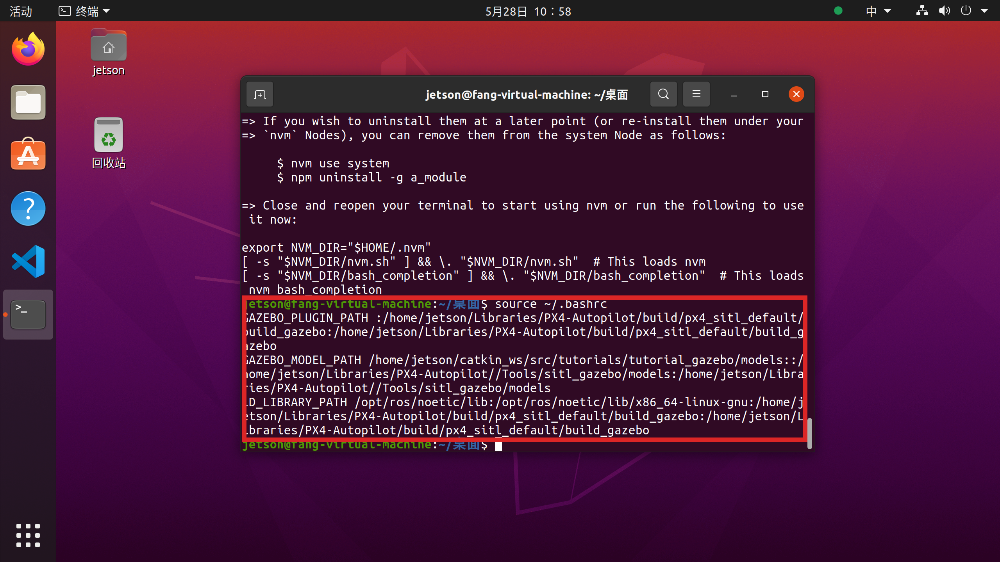

7）输入下面指令，安装Node.js（会自动配置好权限），然后按下回车键。
```
nvm install node
```

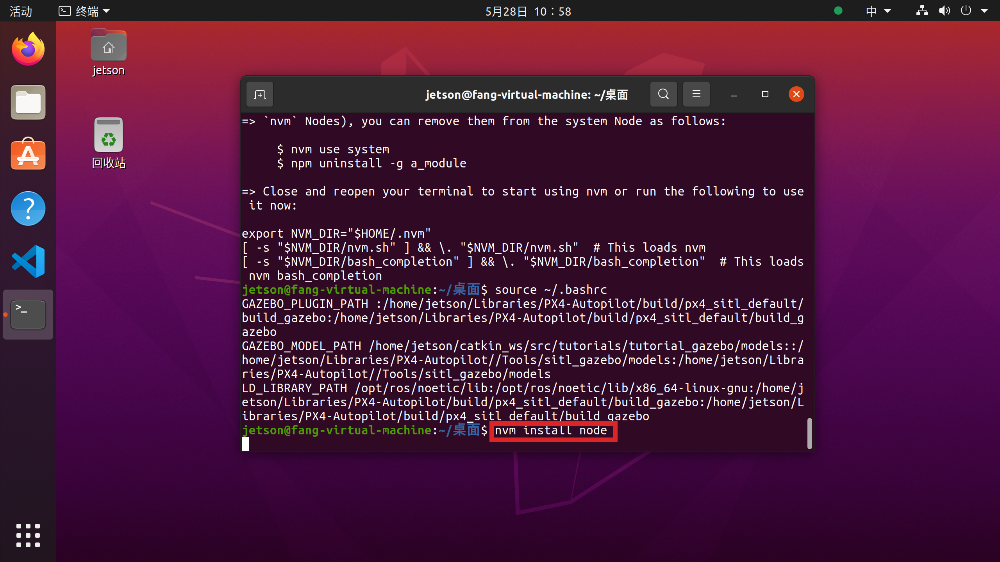

8）右键点击当前界面中的目标位置，然后按下回车键。


9）输入命令，全局安装claude code CLI

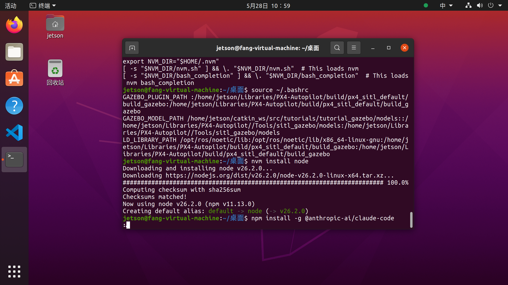

10）点击当前界面中的目标位置，然后输入“claude”，按下回车键。出现图片表明安装成功。

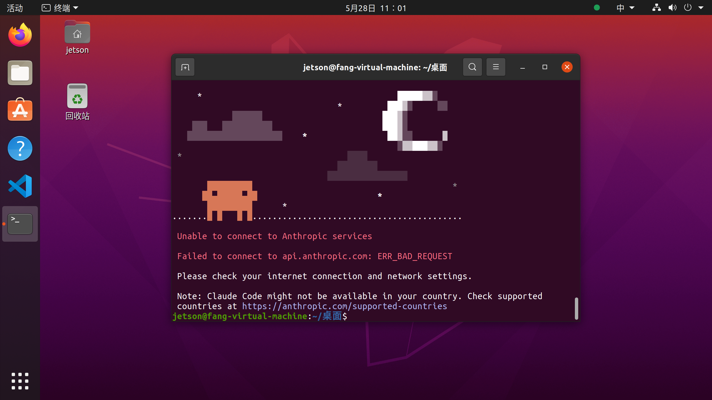

11）在终端中输入命令，按下回车键
```
cd ~/.claude
```
输入下面命令
```
nano settings.json
```

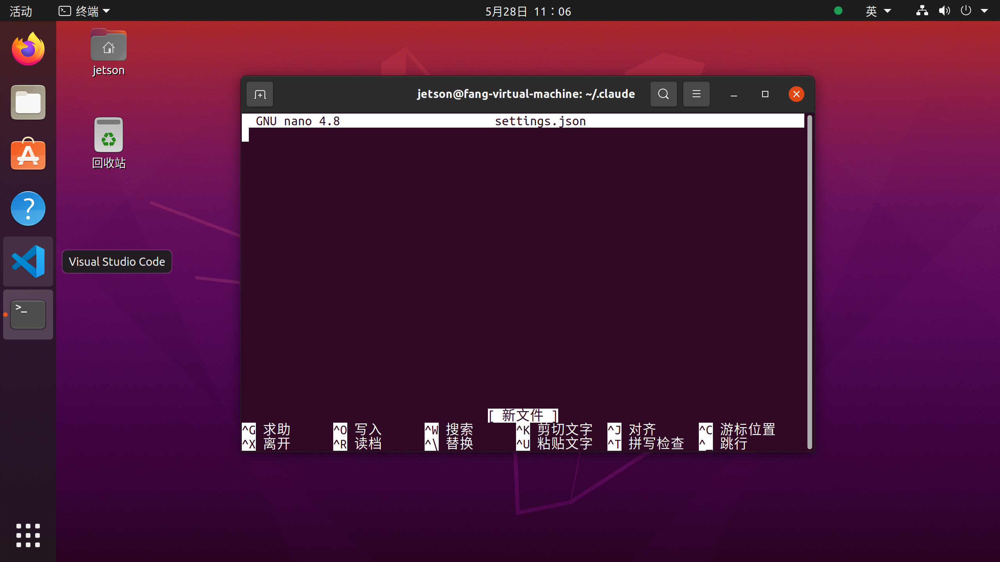

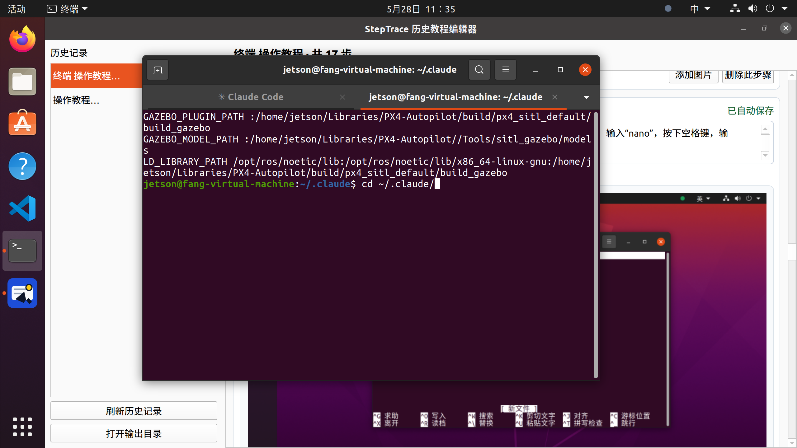

12）打开 settings.json，添加以下配置：
```
{
"apiKey": "sk-ant-your-api-key-here",
"apiBaseUrl": "https://api.anthropic.com/v1"
}
```

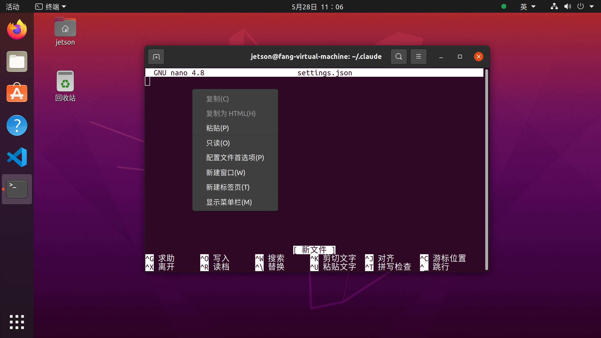

13）再次在终端中输入claude，如下显示表面安装配置成功

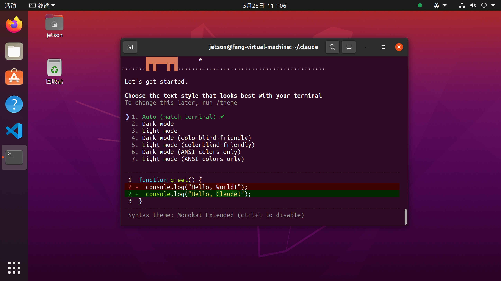

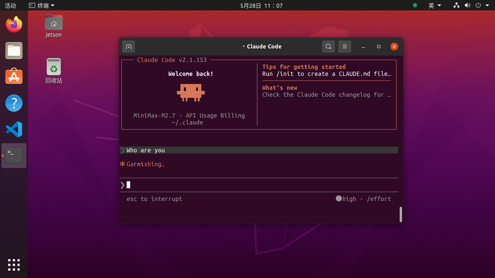

