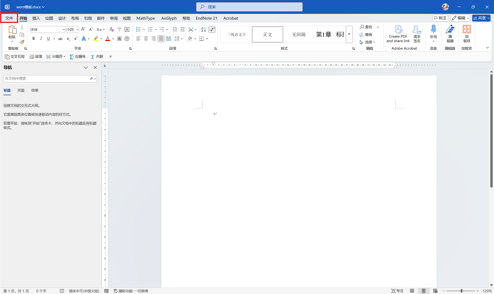
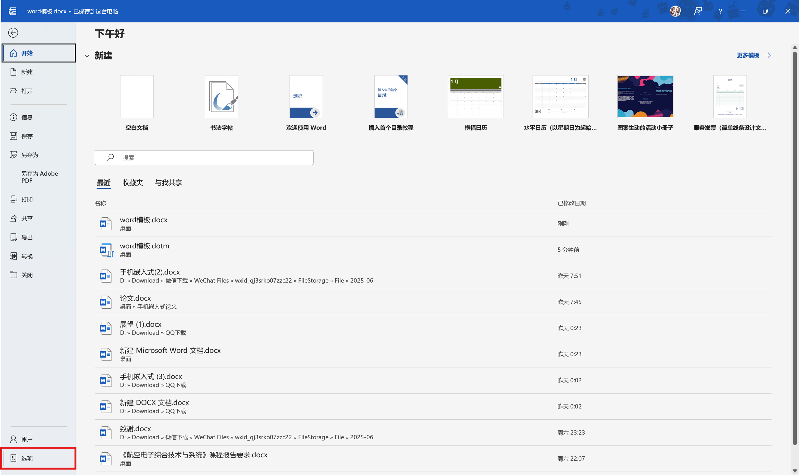
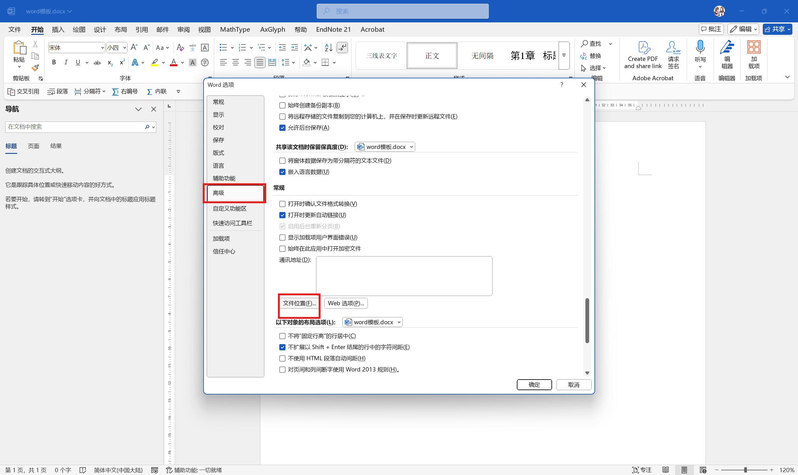
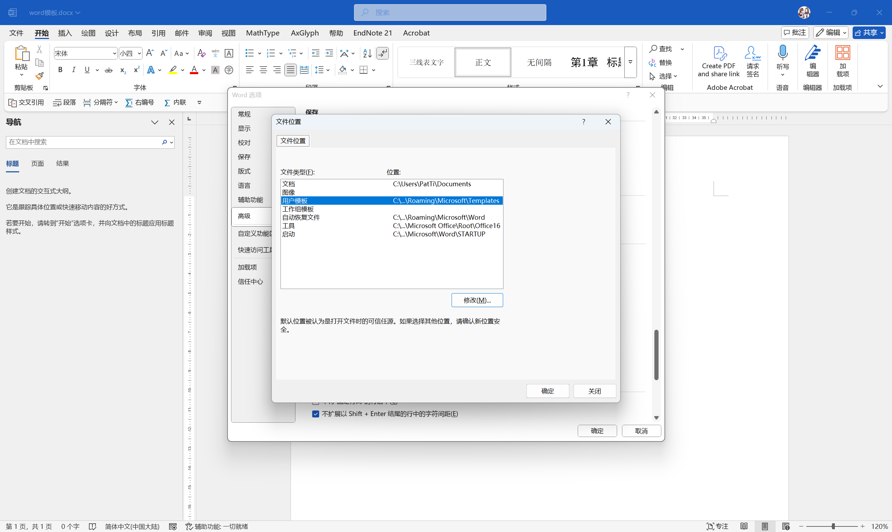
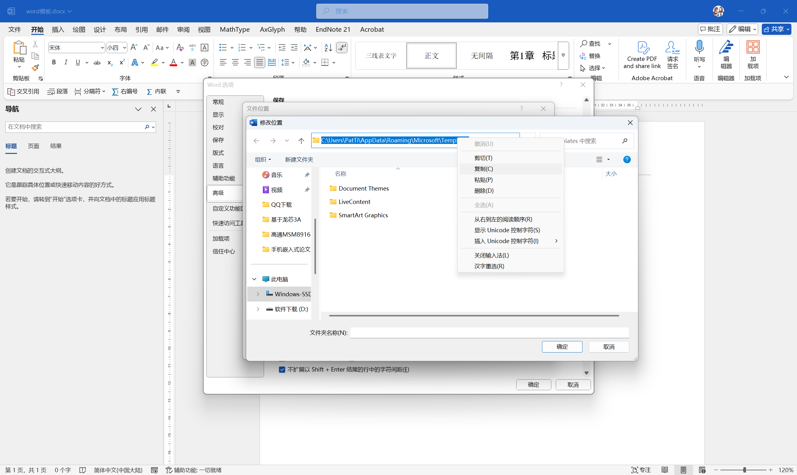
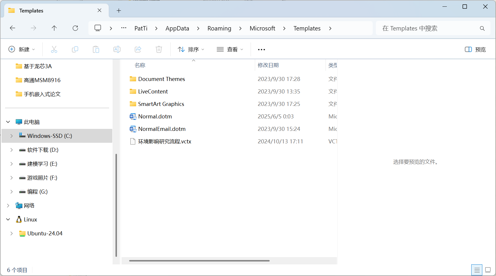
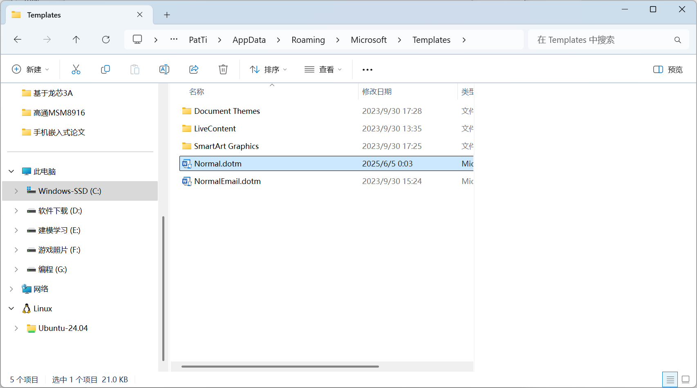

# Word修改默认模板

如何**每次打开一个新的word文档，都直接生成想要的格式**？

**修改word模板文件（Normal.dotm）**

>在我们每次新建word文档的时候，word都会根据其中设定的“用户模板”路径，搜寻路径下一个名为Normal.dotm的文件，也即word的默认模板文件——我们可以把它理解成文档的一个母体，任何一个子文档都是对这一母体的完全复制。而我们目前打开的这一新建的word文档，实际上也就是这一模板文件的副本罢了。^[https://blog.csdn.net/pi_kaqiu/article/details/123702998]

打开任一word文档，

文件 → 选项 → 高级 → 下滑下滑，直到找到图中位置

点击文件位置 → 双击用户模板 → 复制模板路径

 在文件夹中打开，会发现路径下有一Normal.dotm文件：

打开你所要使用的替换文件，删除其全部内容（否则之后的每个word都会保留这些内容）；

选择另存为，选择后缀为.dotm，并将文件名改为Normal，保存到桌面（这里没有直接保存到模板路径下，是因为如果直接保存，很多时候系统会爆出命名不合理的错误，这也是word的保护机制之一，无可厚非）

删除原Normal.dotm文件，并将刚刚新建的Normal.dotm文件复制到模板路径中

