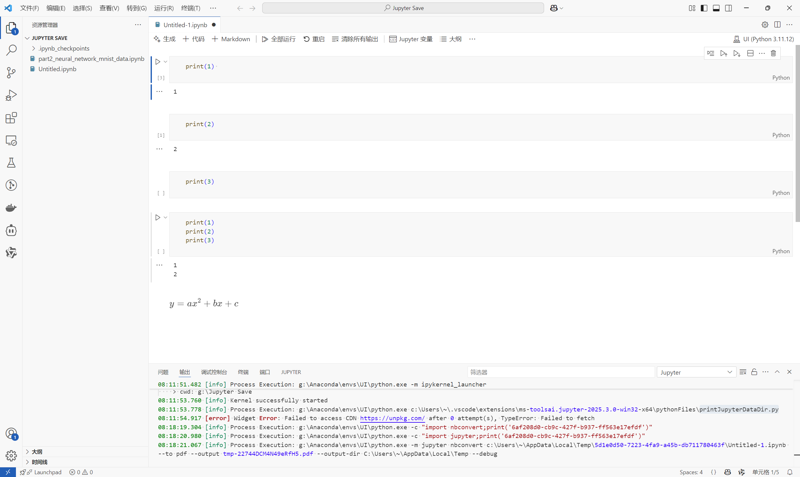
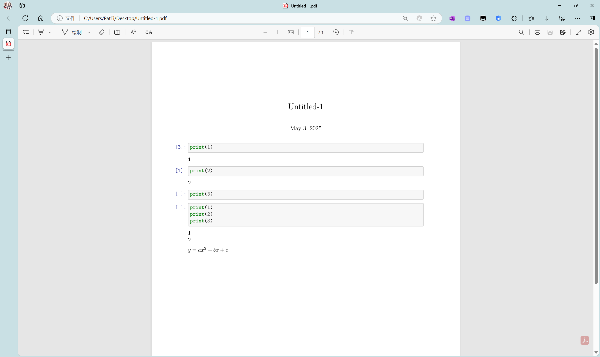

# 02-1-VSCode中Jupyter Notebook的使用

可以参考VS Code官方给出的文档[在 Visual Studio Code 中使用 Jupyter Notebook_Vscode中文网](https://vscode.github.net.cn/docs/datascience/jupyter-notebooks)

# 一、切换模式

存在两种模式，分别为**命令模式**和**编辑模式**

## 命令模式

当处于命令模式时，单元格左侧将出现一个实心垂直条，表示当前选中的单元格。该单元可以进行操作并接受键盘命令。

在键盘上，按`Esc`键可进入命令模式

## 编辑模式

在编辑模式下，单元格编辑器周围有一个实心垂直条由边框连接起来。单元格的内容（代码或 Markdown）可以修改。

在键盘上，按`Enter`键可进入编辑模式

## 模式的切换

要切换模式，可以使用键盘或鼠标。

- 使用键盘时，按`Enter`键可进入编辑模式，按`Esc`键可进入命令模式。
- 使用鼠标时，单击单元格红框以外的区域进入命令模式，单元格红框以内的区域进入编辑模式。

# 二、运行代码

## 运行当前单元格

可以点击单元左侧的**“运行”图标运行代码单元，输出将直接显示在代码单元下方。**

有输出和无输出的对比

使用键盘运行当前单元格时，
- 使用`Ctrl`+`Enter`运行当前单元格。
- 使用`Shift`+`Enter`运行当前单元格并前进到下一个单元格。

`Ctrl`+`Enter`

`Shift`+`Enter`

## 按行运行

按行运行能够按照一行一行的顺序对单元格内的代码进行运行和输出

运行前

运行后

## 运行多个单元格

可以通过选择**运行全部**、**运行上方全部**或**运行下方全部**来运行多个单元格

# 三、基础操作

## 保存文件

在键盘按下`Ctrl`+`S`或点击文件>保存

## 导出Jupyter笔记本

选择界面上方的导出可以导出文件

选择要导出的格式即可

**当存在LaTeX公式时，导出 PDF必须安装 TeX**

可以进入[Get LaTeX - Mac OS, Windows, Linux](https://www.latex-project.org/get/)下载

LaTex的安装可以参考[01-LaTex的下载与安装](Note/语言语法/LaTeX/01-LaTex的下载与安装.md)

安装完成后能够正常导出

