# DEMO_A

# 无线对讲/数据传输模块演示版/评估板

# Spec. V107

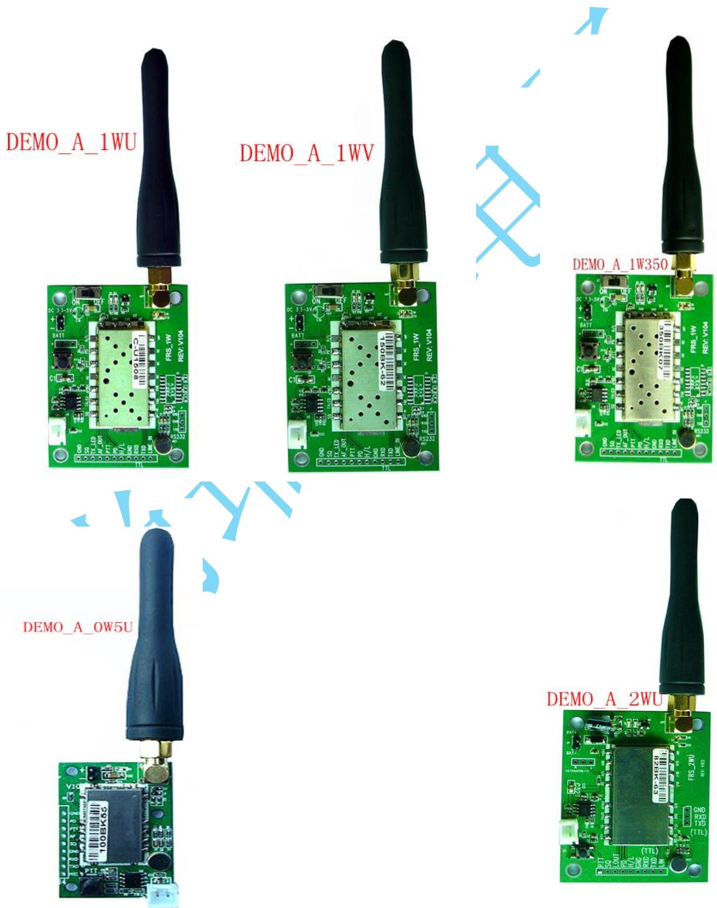

# 演示版综述

1） DEMO_A 系列演示板适用于本公司下列模块： 

SR_FRS_1WU: 1W/400M-480M 

SR_FRS_1WV: 1W/136M-174M 

SR_FRS_1W350: 1W/350M-390M 

SR_FRS_2WUS: 2W/400M-480M 

SR_FRS_0W5U: 0.5W/400M-480M 

2）本对讲机评估板是一个完整功能的对讲机系统, 你只需要接上不超过 5V 的电源就可以做语音对讲，数据传输评估； 

省去您找元器件和焊接的麻烦. 方便您快速进行评估, 有效加快开发进 程; 

3）对讲机模块和评估板均为本公司自主开发，可以给您提供从软件到硬 件的专业技术支持； 

# 本演示版特点

1）语音对讲； 

2）数据传输, 对数据传输实时性要求不高, 数据量不大的情况适用. 

3） 增加一组常用接口, 方便客户测试和开发. 

# 三． 语音对讲使用方法

1）将喇叭插到白色喇叭座里； 

2） 接上附送的天线； 

3）请正确连接直流电源，注意评估板上电池连接极性 

4）直流电源可以用锂电池，碱性电池等，也可以用直流适配器，需要注意的 是电源电压为 3.6V –4.5V, 推荐直流电压为 4.2V （锂电池可直接使用）; 电源的电流供给能力应大于 2倍的模块发射时的正常工作电流; 

5）正确连接电源后，电源指示灯点亮； 

6）按下对讲机的对讲按键 PTT，此时对讲指示灯红灯会亮, 可以进行讲话； 松开PTT 按键, 红色指示灯灭，进入接收状态，可以接收对方的讲话； 

7) 在对演示版进行参数配置时, 模块需要独立供电; 

8) DEMO_A 接口说明 

1) + , - 分别对应电源正负极. 

2) 白色座子接喇叭; 

3) PTT 按键, 

4) 开发接口 

GND, 地线 

SQ, 接收信号指示, 低有效 

TX_LED, 发射状态指示, 高有效; 

AF_OUT, 模块音频直接输出, 幅度最大250MV, 没经过音频功放 

PTT, 0: 发射, 1: 接收 

H/L , 高低功率选择(0.5W 的没有), 特别注意: 

一定不能给高电平, 只能悬空, 或者拉低; 

RXD, TXD, 模块串口, TTL 电平, 3V. 

Line_In, 外接音源输入, 信号必须衰减到 30MV 以内. 

# 四． 参数配置方法以及串口连接示意图

1) 特别注意: 0W5U, 0W5V, 1WU, 1WV, 1W350 指令是一样的. 

2WUS 指令不一样,有精简, 请对照模块规格书. 

以下例子, 以 0W5U, 0W5V, 1WU, 1WV, 1W350 指令为例. 

设置指令请参考本公司相应模块的规格书，请联系客服索取, 或者到本公司 官网下载. 

2) 

由于本公司模块有模拟，和数字两个系列。以下说明只针对本公司模拟的模 块； 

数字的模块命令因为跟模拟的不同，波特率也不同，请参照数字模块的通 信协议进行设置； 

3) 公司新版的 0W5U, 2WUS, 参数设置后, 掉电可以保持; 

1WU, 1WV, 1W350 目前不能掉电保持, 需要配合单片机使用, 可以考虑 我司 DEMO_B, DEMO_D. 

# 4.1 演示版串口连接示意图，以 DEMO_A_1WU 为例，

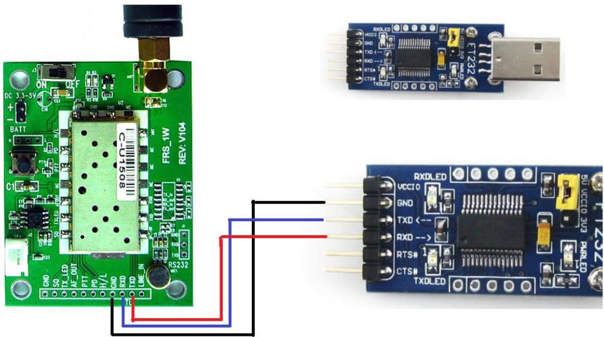

请用户自己准备 USB 转串口（TTL 电平的）小板，按照图示交叉连接； 

串口工具推荐CH340系列的. 使用时, 把串口工具上的电源跳线,接到3.3V 上, 不能 用 5V. 

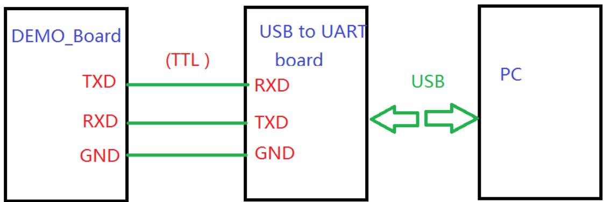

# 4.2 用电脑演示时，电脑端串口设置

串口号选择：参考“我的电脑\属性\设备管理器\LPT /COM ”来选择活动的 串口号； 

波特率：必须是 9600； 

校验位：无 

数据位：8 

停止位：1 

# 4.4 参数设置方法

# 4.4.1 本公司 0W5U, 0W5V, 1WU, 1WV, 1W350 模块的设置方法

这里以”串口调试助手”软件为例, 串口调试助手可找我司业务索取。 

切记： 必须在英文输入环境下进行命令设置 

1) 以组设置命令为例, 当需要设置频率，亚音频时，等参数时, 输入命令: 

AT+DMOSETGROUP=0,450.0500,450.2500，1，2，1，0(回车) 

带 发射频率,接收频率, 接 静 发 其 

宽 收 噪 射 他 

亚 等 亚 

音 级 音 

# 参数依次为：

0：窄带 

450.0500：发射频率（ MHZ） 

450.2500：接收频率 （ MHZ） 

1：接收亚音频: 

2：SQ 静噪 (一般不用改, 保持 2) 

1：发射亚音频 

0：发射功率 1W, 压扩 OFF,繁忙禁发 OFF 

注意: 发送频率, 接收频率可分别设置,也可设置相同; 

发送亚音频,接收亚音频也可单独设置,也可设置相同; 

由于 DEMO_A 不带单片机控制, 所设置的参数掉电不能保持; 

2) 关于设置指令 

必须在英文输入环境下输入; 

不能有空格, 

文本输入后, 在发送前, 转到”按十六进制” 发送, 检查下, 最后面的回 车换行”0D 0A” 只能有一组. 

3) 关于亚音频, 

0, 关闭亚音频 

1-38 模拟亚音频 

39-121 数字亚音频. 

1-121 亚音编号对应的实际亚音频频率, 请找我司业务索取. 

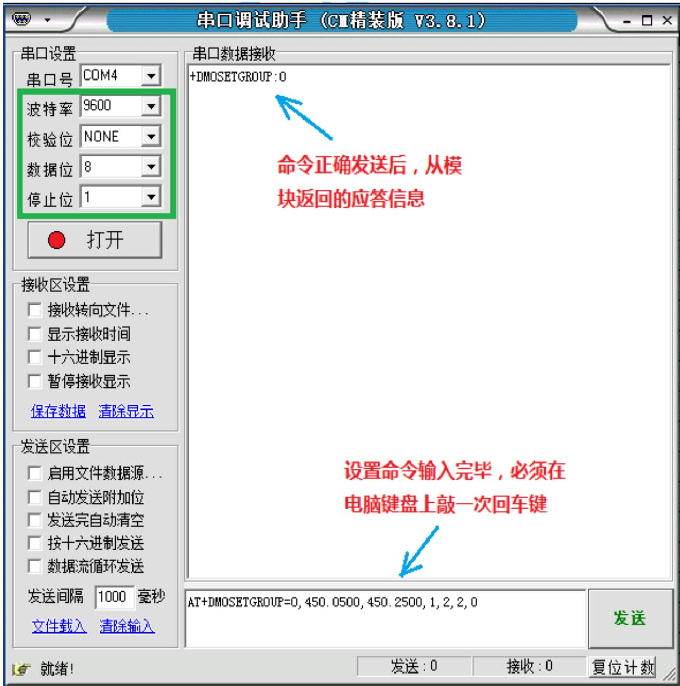

命令输入完毕, 注意:必须在命令末尾敲一次回车键; 然后点击”发送” 

正常时返回值如下： 

+DMOSETGROUP:0 

# 5 短信息（数据传输）发送

准备两台 PC 机, 所有演示版都必须和电脑正确连接；假设 PC1 用来传 输数据， PC2 用来接收数据； 

# 5.1 PC1 发送命令：

1)没有勾选“按16进制发送”,也即用文本模式输入命令: 

AT+DMOMES=7ABCDEFG（必须回车） 

输入命令后，必须敲键盘上的回车键一次； 

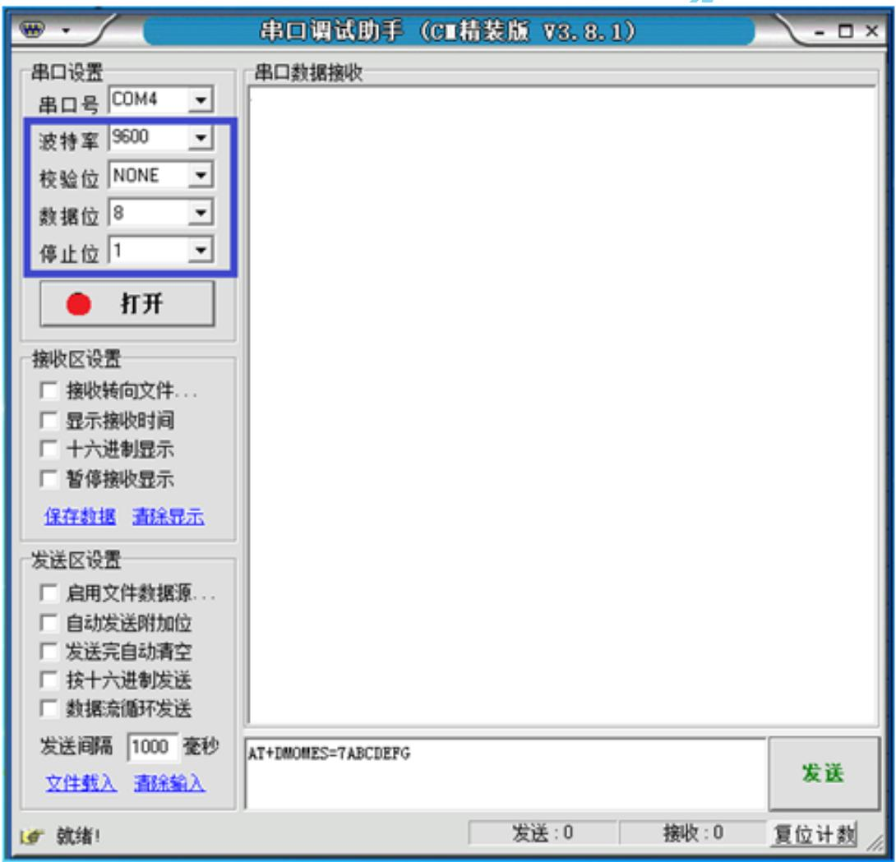

由于短信息命令中的长度字节是十六进制的,所以需要进入十六进 制模式,人工修改长度; 

# 2)勾选“按16进制发送”

发送区文本格式的命令会自动转成十六进制 

41 54 2B 44 4D 4F 4D 45 53 3D 37 41 42 43 44 45 46 47 0D 0A 

必须人工把代表长度的 “37” 改成 “07” ， 因为此命令中，表示 长度的字节是十六进制的; 

修改后的正确命令为: 

41 54 2B 44 4D 4F 4D 45 53 3D 07 41 42 43 44 45 46 47 0D 0A 

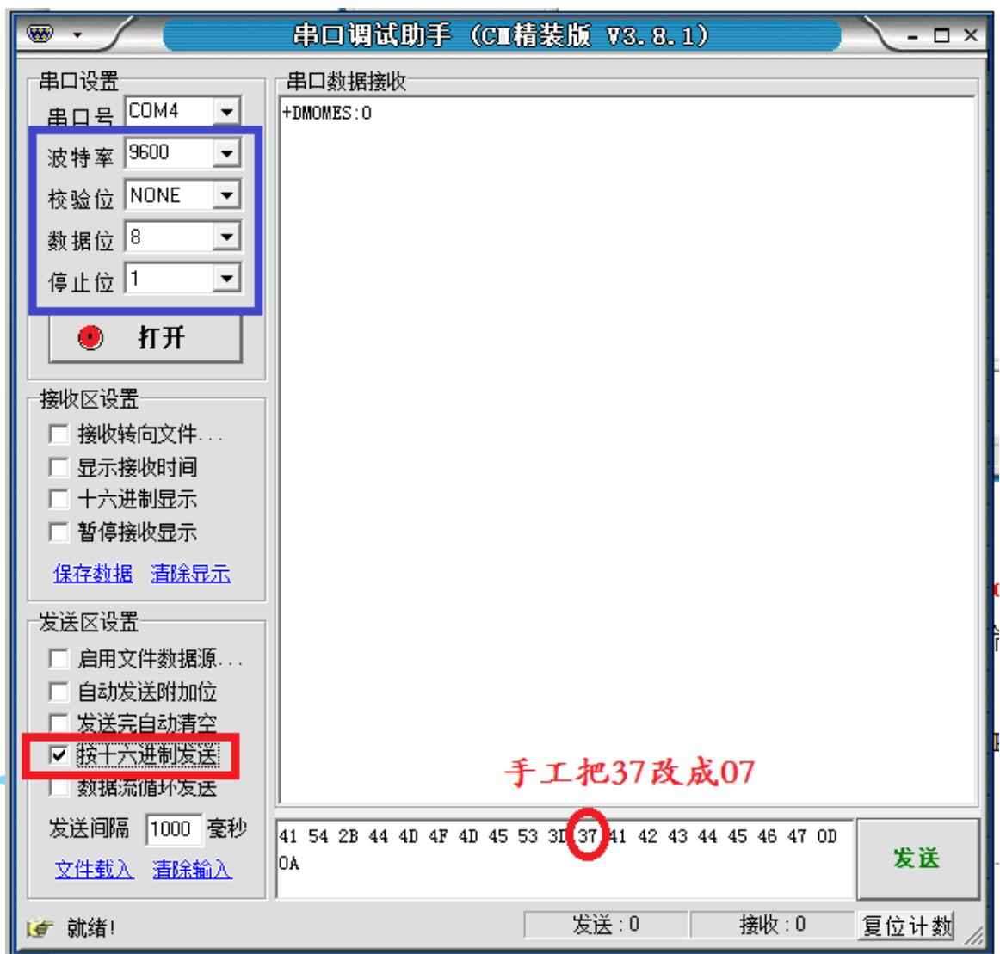

送结果给 PC, 此时 PC1 上的串口调试助手的接收区会显示 

+ DMOMES：0 

如果设置命令错误, 则显示: 

+ DMOMES：1 

# 5.2 PC2 接收数据：

当模块接收到数据后，会自动通过串口上传到 PC,并显示在串口调试 助手的接收区； 

1) 当接收区没有勾选“十六进制显示”(也即文本模式) ，显示的内 容为：+DMOMES=*ABCDEFG 

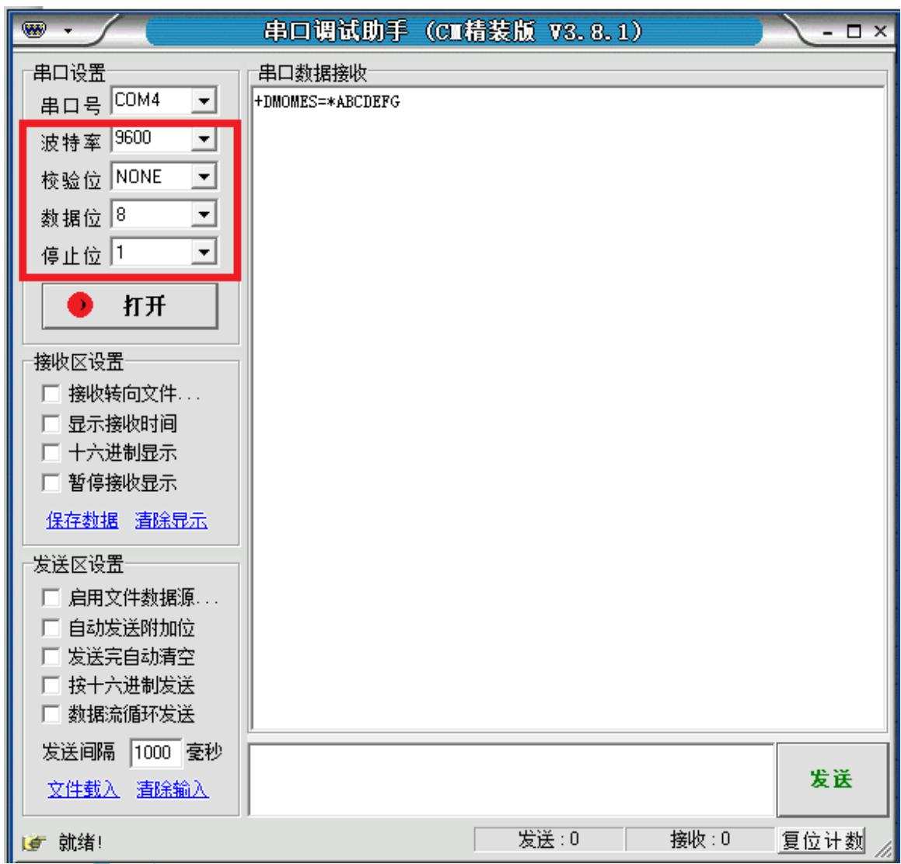

2) 当接收区勾选“十六进制显示” ，显示的内容为： 

2B 44 4D 4F 4D 45 53 3D 07 41 42 43 44 45 46 47 0D 0A 

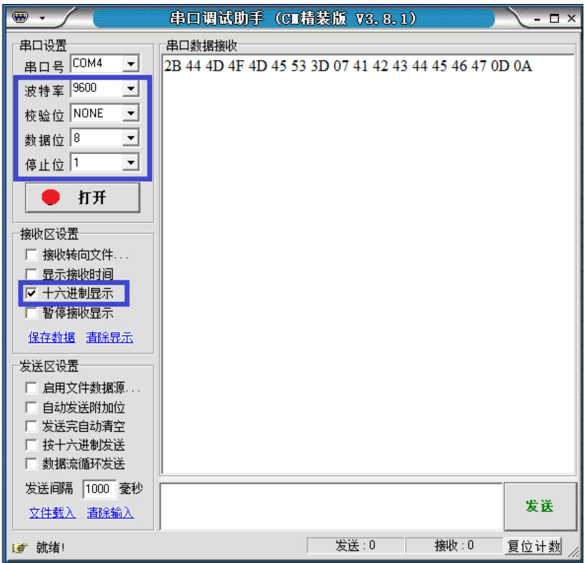

# 4.4.2 本公司 2WUS模块的设置方法

# 1. 注意：

1） 2WUS 指令不同于 0W5U, 0W5V, 1WU,1WV,1W350， 指令有精简。 

2) 2WUS 频率设置指令中， 亚音频指令不是文本(ASCII)的，是十六进 制的，因此，用文本的方法输入指令后， 必须切换到 十六进制（HEX）, 手工 做调整后才能用。 

3) 需在英文输入法环境下进行指令设置 

举例， 2WUS 频率，亚音频设置: 频率 450.02500，亚音 67.0HZ 

指令： AT+DMOGRP=450.02500,450.02500,RR,TT,0,0 (回车/换行符) 

接收 

发射 

接收,发射 

频率 

频率 

亚音 亚音 

# 2. 设置流程

1）在文本（ASCII）格式下输入指令，频率直接改成你想要的。 指令末尾敲击一次回车 

AT+DMOGRP=450.02500,450.02500,RR,TT,0,0 

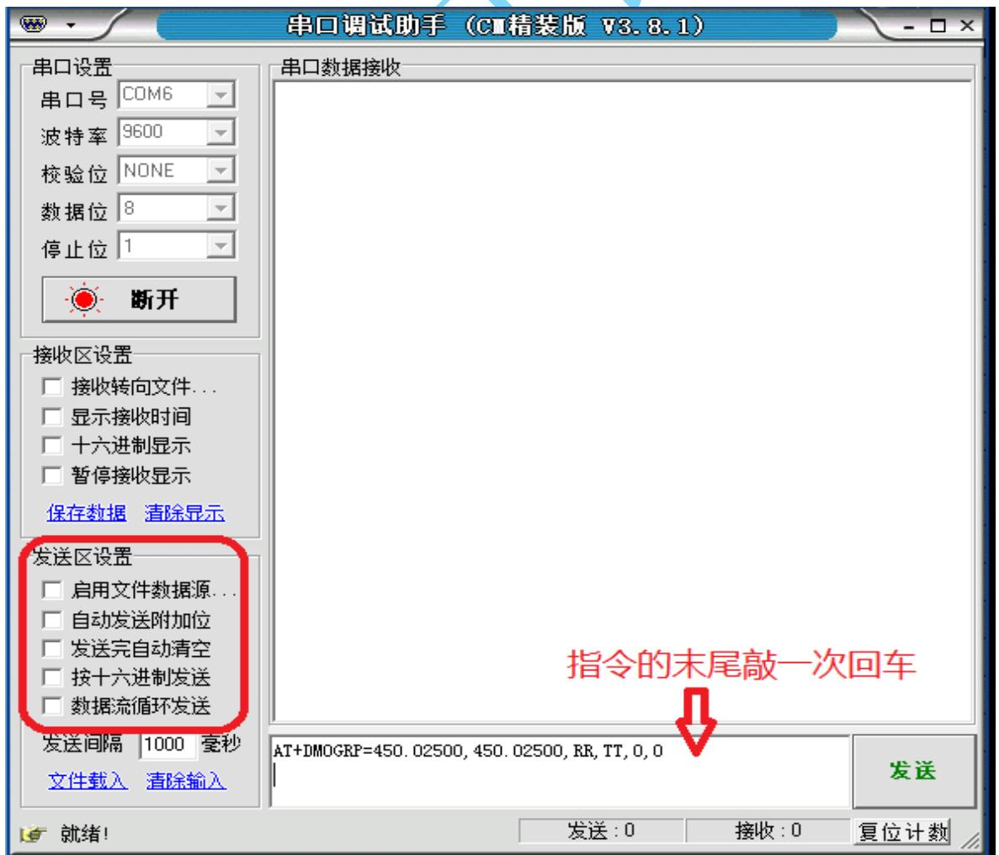

# 2) 在发射区设置里， 勾上“按十六进制发送” 在箭头所指的对应地方更改你想要的亚音值

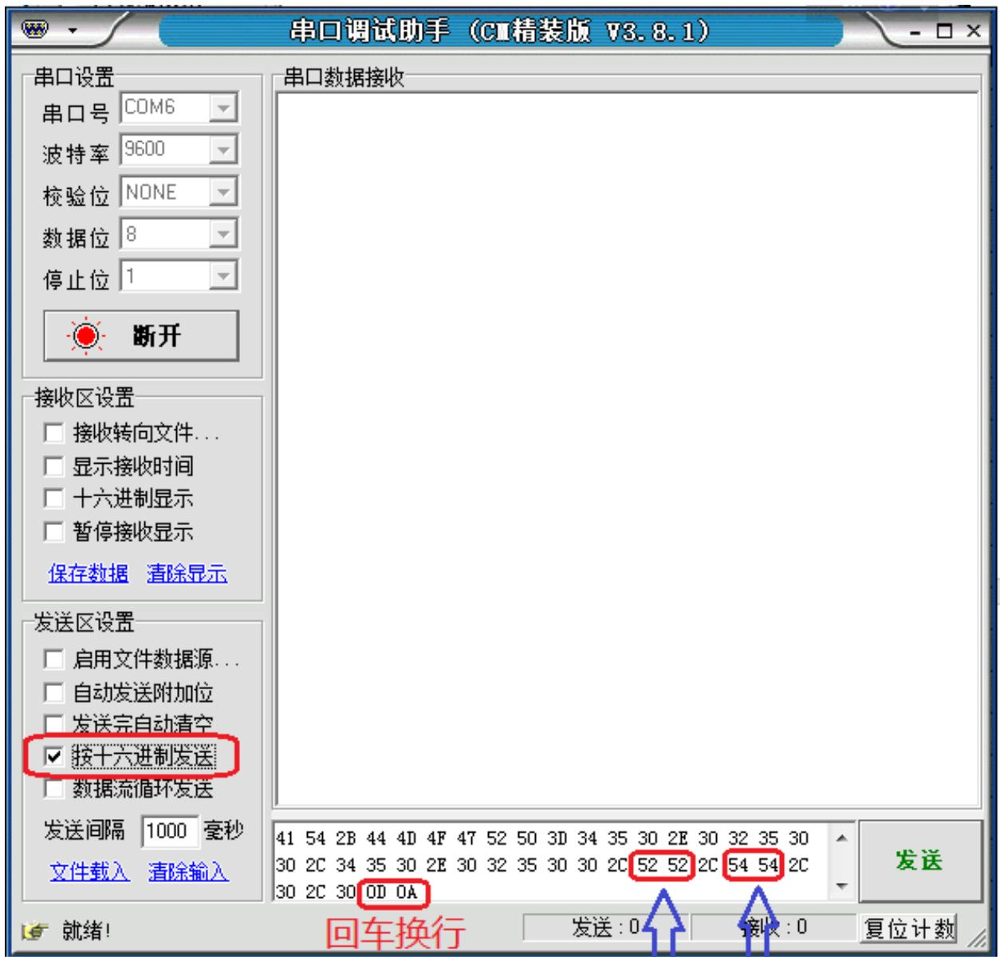

接收 发射 

亚音 亚音 

4）假如要设置 67.0HZ 的亚音, 指令格式为十六进制（HEX）70 06 把对应的地方改为 70 06 

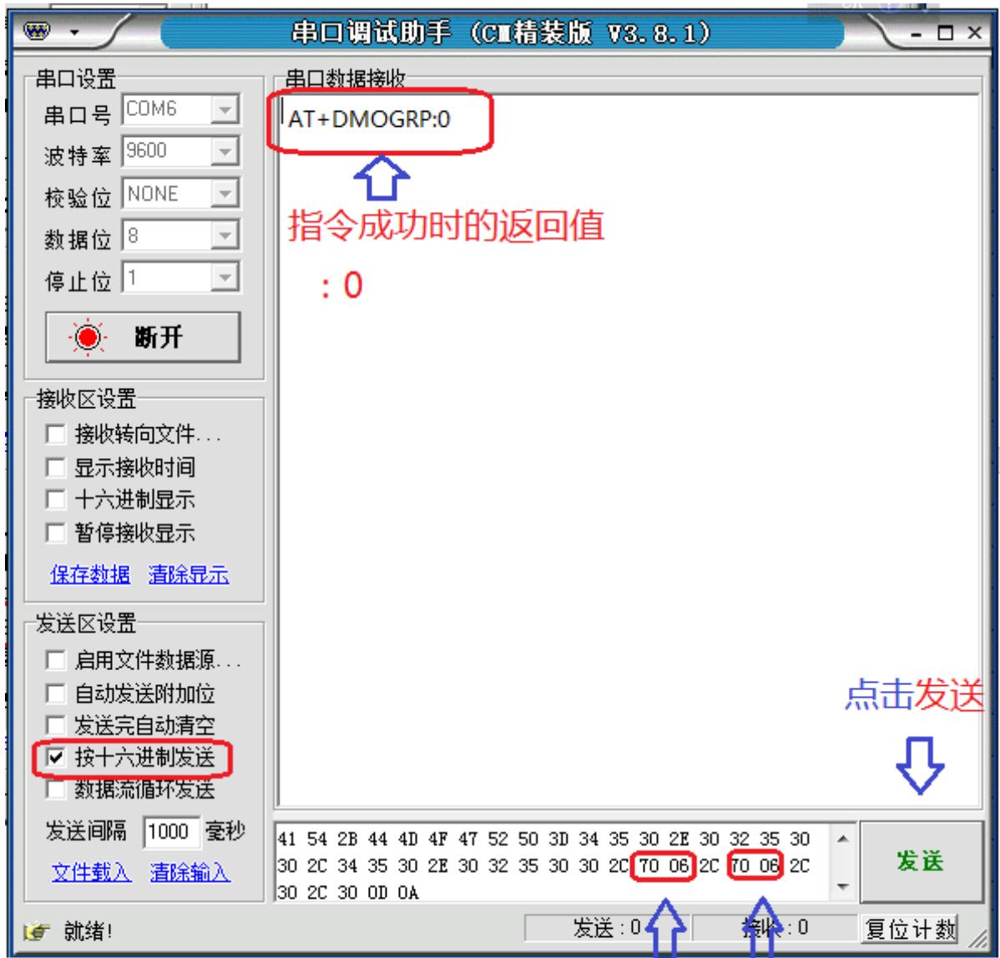

接收_发射 

亚音 亚音 

5）数据传送， 参见 1WU 的说明 

6）其他指令均为文本格式，可以直接输入， 点击发送。 

# 五． 针对客户自己设计的产品, 模块应用的几点说明:

1) PD 必须 给高电平才能进入工作状态. 

2) 语音对讲时, PTT 为低电平进入发射状态, PTT 为高, 或者悬空, 进入接收状态. 

3) 数据传输时, 

模块内部自动启动发射, 不需要操作PTT. 

如果收发两端, 在省电模式, 模块每次发射会先发射 1S 的唤醒码, 接着再发数据, 发送时间比较长. 如果想要比较快的 收发速度, 请 收发两端关闭省电模式. 

带宽设为 宽带, 有助于收发数据的可靠性. 

模块一次最多只能发送 60BYTE 数据. 

4) 模块的 SQ / SPK_EN 脚位, 

用来告知用户, 有收到对方的发射信号, SQ 是模块的输出信号, 高电平: 没收到信号; 0: 有收到信号; 

此信号有两个作用: 

做接收指示灯控制; 

用来做音频功放静噪控制, 低电平时, 打开音频功放, 播放接收声 音; 高电平时关闭音频功放, 关闭接收音频功放, 喇叭静音; 防止 没有收到信号时, 喇叭里有杂音, 并且省电. 

5) 模块出厂默认参数, 亚音频一般是关闭的, 会出现偶尔自 动打开接收的情况, 请设置亚因频打开, 可解决这个情况. 

6) 如果是用我司模块配合第三方对讲机使用, 必须注意. 

收发频率一样; 

亚音频一样; 

带宽设置一样; 

7) 关于电源 

优先考虑锂电池, 干电池; 推荐工作电压 3.6-4.5以内. 

DCDC 降压电路, 必须做好滤波, 否则会引入干扰, 并降低模块接收 灵敏度; 

. 针对 5V 电源, 请串联一个硅二极管, 比如 1N4007 之类的进行降 压到 4.5V 以内. 

# 8) 关于天线

原则上,天线的谐振频率必须跟模块设定的工作频率一致, 才能达到 最高效率, 最高距离. 所以天线尽量找天线厂家定制. 客户需提供 产品完整外壳给天线厂家. 

请不要在不知道天线谐振频率的情况下,随便拿来就用, 会严重影响 发射功率和接收灵敏度; 

用户在使用自己定义的模块工作频率时,一定要找专业的天线厂家定 制天线相应的谐振频率. 

# 9) 关于距离

距离受很多因素影响, 

发射功率 

接收灵敏度 

天线匹配 

使用环境 

使用高度 

天气 

所以请不要再问我城市里, 山区里能有多远, 神仙也说不清楚, 我 们只能给个大概的参考距离, 条件是, 开阔地, 无任何遮挡情况下 的大概距离. 

# 10) 演示版外接更大功率音频功放的接法

AF_OUT, GNG 接音频功放的 信号输入 和 GND; 有可能功 放声音会小. 

从喇叭输出这里接功放, SP+, SP- 任选一个, 串联100UF 电解电 容, 到外接功放音频信号输入; 再连接两边的 GND. 这样音频功 放声音会较大, 因为信号有经过演示版上的音频功放放大. 

# 六 模拟亚音频和数字亚音频列表

1．CTCSS 列表 模拟亚音频

<table><tr><td>CH</td><td>FREQ.</td><td>CH</td><td>FREQ.</td><td>CH</td><td>FREQ.</td></tr><tr><td>1</td><td>67.0</td><td>13</td><td>103.5</td><td>26</td><td>162.2</td></tr><tr><td></td><td></td><td>14</td><td>107.2</td><td>27</td><td>167.9</td></tr><tr><td>2</td><td>71.9</td><td>15</td><td>110.9</td><td>28</td><td>173.8</td></tr><tr><td>3</td><td>74.4</td><td>16</td><td>114.8</td><td>29</td><td>179.9</td></tr><tr><td>4</td><td>77.0</td><td>17</td><td>118.8</td><td>30</td><td>186.2</td></tr><tr><td>5</td><td>79.7</td><td>18</td><td>123.0</td><td>31</td><td>192.8</td></tr><tr><td>6</td><td>82.5</td><td>19</td><td>127.3</td><td>32</td><td>203.5</td></tr><tr><td>7</td><td>85.4</td><td>20</td><td>131.8</td><td>33</td><td>210.7</td></tr><tr><td>8</td><td>88.5</td><td>21</td><td>136.5</td><td>34</td><td>218.1</td></tr><tr><td>9</td><td>91.5</td><td>22</td><td>141.3</td><td>35</td><td>225.7</td></tr><tr><td>10</td><td>94.8</td><td>23</td><td>146.2</td><td>36</td><td>233.6</td></tr><tr><td>11</td><td>97.4</td><td>24</td><td>151.4</td><td>37</td><td>241.8</td></tr><tr><td>12</td><td>100.0</td><td>25</td><td>156.7</td><td>38</td><td>250.3</td></tr></table>

2．DCS 列表

数字亚音频

<table><tr><td>CH</td><td>CODE</td><td>CH</td><td>CODE</td><td>CH</td><td>CODE</td><td>CH</td><td>CODE</td><td>CH</td><td>CODE</td></tr><tr><td>39</td><td>N023</td><td>58</td><td>N132</td><td>77</td><td>N265</td><td>96</td><td>N464</td><td>115</td><td>N712</td></tr><tr><td>40</td><td>N025</td><td>59</td><td>N134</td><td>78</td><td>N271</td><td>97</td><td>N465</td><td>116</td><td>N723</td></tr><tr><td>41</td><td>N026</td><td>60</td><td>N143</td><td>79</td><td>N306</td><td>98</td><td>N466</td><td>117</td><td>N731</td></tr><tr><td>42</td><td>N031</td><td>61</td><td>N152</td><td>80</td><td>N311</td><td>99</td><td>N503</td><td>118</td><td>N732</td></tr><tr><td>43</td><td>N032</td><td>62</td><td>N155</td><td>81</td><td>N315</td><td>100</td><td>N506</td><td>119</td><td>N734</td></tr><tr><td>44</td><td>N043</td><td>63</td><td>N156</td><td>82</td><td>N331</td><td>101</td><td>N516</td><td>120</td><td>N743</td></tr><tr><td>45</td><td>N047</td><td>64</td><td>N162</td><td>83</td><td>N343</td><td>102</td><td>N532</td><td>121</td><td>N754</td></tr><tr><td>46</td><td>N051</td><td>65</td><td>N165</td><td>84</td><td>N346</td><td>103</td><td>N546</td><td></td><td></td></tr><tr><td>47</td><td>N054</td><td>66</td><td>N172</td><td>85</td><td>N351</td><td>104</td><td>N565</td><td></td><td></td></tr><tr><td>48</td><td>N065</td><td>67</td><td>N174</td><td>86</td><td>N364</td><td>105</td><td>N606</td><td></td><td></td></tr><tr><td>49</td><td>N071</td><td>68</td><td>N205</td><td>87</td><td>N365</td><td>106</td><td>N612</td><td></td><td></td></tr><tr><td>50</td><td>N072</td><td>69</td><td>N223</td><td>88</td><td>N371</td><td>107</td><td>N624</td><td></td><td></td></tr><tr><td>51</td><td>N073</td><td>70</td><td>N226</td><td>89</td><td>N411</td><td>108</td><td>N627</td><td></td><td></td></tr><tr><td>52</td><td>N074</td><td>71</td><td>N243</td><td>90</td><td>N412</td><td>109</td><td>N631</td><td></td><td></td></tr><tr><td>53</td><td>N114</td><td>72</td><td>N244</td><td>91</td><td>N413</td><td>110</td><td>N632</td><td></td><td></td></tr><tr><td>54</td><td>N115</td><td>73</td><td>N245</td><td>92</td><td>N423</td><td>111</td><td>N654</td><td></td><td></td></tr><tr><td>55</td><td>N116</td><td>74</td><td>N251</td><td>93</td><td>N431</td><td>112</td><td>N662</td><td></td><td></td></tr><tr><td>56</td><td>N125</td><td>75</td><td>N261</td><td>94</td><td>N432</td><td>113</td><td>N664</td><td></td><td></td></tr><tr><td>57</td><td>N131</td><td>76</td><td>N263</td><td>95</td><td>N445</td><td>114</td><td>N703</td><td></td><td></td></tr></table>

