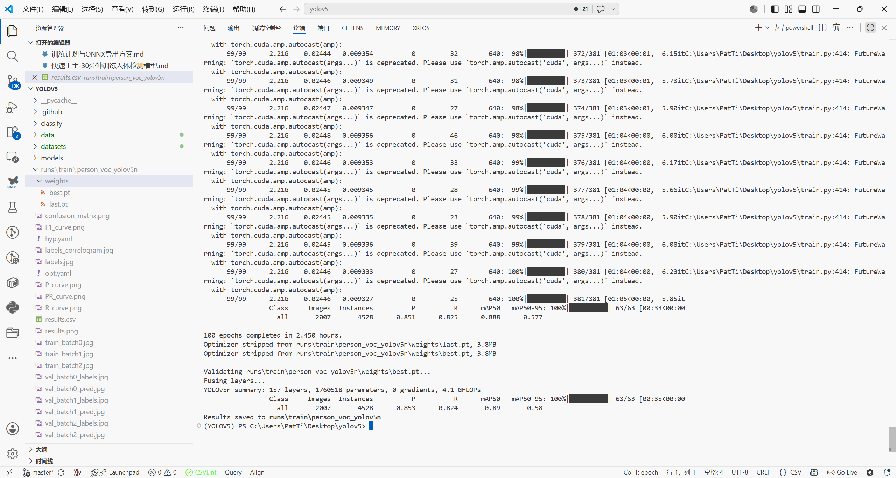

# 快速上手：30 分钟训练人体检测模型

本文演示如何使用 PASCAL VOC 2007+2012 中的 `person` 类，在本仓库训练一个 YOLOv5 单类人体检测模型，并导出 ONNX 文件。

适用目标：

- 数据集：PASCAL VOC person 子集
- 模型：`yolov5n`，适合 RTX 3060 6GB 这类显存较小的设备
- 产物：`runs/train/person_voc_yolov5n/weights/best.onnx`
- 时间：环境已就绪时约 30-35 分钟；首次安装环境通常需要 40-55 分钟

注意：PASCAL VOC 是公开学术数据集。若用于商业产品，请先确认数据许可。

---

## 1. 命令环境约定

本文同时给出 Git Bash / WSL / Linux 与 PowerShell 命令。两者主要区别如下：

| 环境 | 路径写法 | 多行续行 |
|------|----------|----------|
| Git Bash / WSL / Linux | `/c/Users/PatTi/Desktop/yolov5` | `\` |
| PowerShell | `C:\Users\PatTi\Desktop\yolov5` | 建议直接用单行命令 |

如果不确定自己使用的是哪种终端，在 Windows 上优先复制 PowerShell 单行命令。

---

## 2. 流程总览

完整流程如下：

1. 安装 PyTorch、YOLOv5 依赖和 ONNX 工具。
2. 下载并解压 PASCAL VOC 2007 trainval、2007 test、2012 trainval。
3. 运行 `tools/extract_voc_person.py` 提取 `person` 子集。
4. 创建 `datasets/person_voc/person.yaml`。
5. 训练 `yolov5n`。
6. 评估模型并导出 ONNX。
7. 用 `verify_onnx.py` 检查 ONNX 结构和推理是否可运行。

---

## 3. 准备环境

推荐使用 Python 3.10 或 3.11。若当前 Python 版本太新导致 PyTorch 安装失败，建议用 conda 单独创建环境。

### Git Bash / WSL / Linux

```bash
cd /c/Users/PatTi/Desktop/yolov5
pip install torch torchvision torchaudio --index-url https://download.pytorch.org/whl/cu118
pip install -r requirements.txt
pip install onnx onnx-simplifier onnxruntime-gpu
```

### PowerShell

```powershell
cd C:\Users\PatTi\Desktop\yolov5
pip install torch torchvision torchaudio --index-url https://download.pytorch.org/whl/cu118
pip install -r requirements.txt
pip install onnx onnx-simplifier onnxruntime-gpu
```

验证 PyTorch 是否能看到 GPU：

```bash
python -c "import torch; print(torch.__version__, torch.cuda.is_available())"
```

输出中的第二项应为 `True`。如果是 `False`，仍可用 CPU 跑通流程，但训练会明显变慢。

---

## 4. 下载 PASCAL VOC 数据

需要下载三个压缩包，总大小约 2.8 GB：

- `VOCtrainval_06-Nov-2007.tar`
- `VOCtest_06-Nov-2007.tar`
- `VOCtrainval_11-May-2012.tar`

### Git Bash / WSL / Linux

```bash
cd /c/Users/PatTi/Desktop/yolov5
mkdir -p datasets/VOC_raw
cd datasets/VOC_raw

curl -L -O https://pjreddie.com/media/files/VOCtrainval_06-Nov-2007.tar
curl -L -O https://pjreddie.com/media/files/VOCtest_06-Nov-2007.tar
curl -L -O https://pjreddie.com/media/files/VOCtrainval_11-May-2012.tar

tar -xf VOCtrainval_06-Nov-2007.tar
tar -xf VOCtest_06-Nov-2007.tar
tar -xf VOCtrainval_11-May-2012.tar
```

### PowerShell

```powershell
cd C:\Users\PatTi\Desktop\yolov5
New-Item -ItemType Directory -Force -Path datasets\VOC_raw | Out-Null
cd datasets\VOC_raw
curl.exe -L -O https://pjreddie.com/media/files/VOCtrainval_06-Nov-2007.tar
curl.exe -L -O https://pjreddie.com/media/files/VOCtest_06-Nov-2007.tar
curl.exe -L -O https://pjreddie.com/media/files/VOCtrainval_11-May-2012.tar
tar -xf VOCtrainval_06-Nov-2007.tar
tar -xf VOCtest_06-Nov-2007.tar
tar -xf VOCtrainval_11-May-2012.tar
```

解压后应得到下面的目录：

```text
datasets/VOC_raw/VOCdevkit/VOC2007/
datasets/VOC_raw/VOCdevkit/VOC2012/
```

如果 `pjreddie.com` 下载较慢，可以改用 PASCAL VOC 镜像或 Ultralytics 的 VOC 快照。下载完成后仍需保证目录结构与上面一致。

---

## 5. 提取 person 子集

本仓库已提供提取脚本：`tools/extract_voc_person.py`。脚本会从 VOC XML 标注中筛选 `person` 类，并转换成 YOLO 标签格式。

### Git Bash / WSL / Linux

```bash
cd /c/Users/PatTi/Desktop/yolov5
python tools/extract_voc_person.py
```

### PowerShell

```powershell
cd C:\Users\PatTi\Desktop\yolov5; python tools\extract_voc_person.py
```

典型输出规模：

```text
训练集: 6095 张
验证集: 2007 张
数据集位置: datasets/person_voc
```

提取后的目录应为：

```text
datasets/person_voc/
  images/
    train/
    val/
  labels/
    train/
    val/
```

每个标签文件是一行或多行 YOLO 格式：

```text
0 x_center y_center width height
```

其中 `0` 表示唯一类别 `person`，坐标均为相对图片宽高的归一化值。

---

## 6. 创建数据集配置

新建或检查 `datasets/person_voc/person.yaml`：

```yaml
path: C:/Users/PatTi/Desktop/yolov5/datasets/person_voc
train: images/train
val: images/val

nc: 1
names:
  0: person
```

路径建议使用绝对路径，并用正斜杠 `/`。如果项目目录不是 `C:/Users/PatTi/Desktop/yolov5`，需要把 `path` 改成你自己的实际路径。

也可以使用相对路径：

```yaml
path: datasets/person_voc
train: images/train
val: images/val

nc: 1
names:
  0: person
```

相对路径是否可用取决于运行 `python train.py` 时所在的工作目录。最稳妥的方式是在 YOLOv5 项目根目录执行训练命令。

---

## 7. 训练模型

推荐先训练 `yolov5n`。它速度快、显存占用低，适合 6GB 显存设备快速验证流程。

### Git Bash / WSL / Linux

```bash
cd /c/Users/PatTi/Desktop/yolov5
python train.py \
  --data datasets/person_voc/person.yaml \
  --cfg yolov5n.yaml \
  --weights yolov5n.pt \
  --hyp data/hyps/hyp.person_voc.yaml \
  --epochs 100 \
  --batch-size 16 \
  --img-size 640 \
  --device 0 \
  --workers 2 \
  --project runs/train \
  --name person_voc_yolov5n
```

### PowerShell

```powershell
cd C:\Users\PatTi\Desktop\yolov5; python train.py --data datasets/person_voc/person.yaml --cfg yolov5n.yaml --weights yolov5n.pt --hyp data/hyps/hyp.person_voc.yaml --epochs 100 --batch-size 16 --img-size 640 --device 0 --workers 2 --project runs/train --name person_voc_yolov5n
```

参数说明：

| 参数 | 作用 |
|------|------|
| `--cfg yolov5n.yaml` | 使用 YOLOv5 Nano 结构 |
| `--weights yolov5n.pt` | 从预训练权重开始迁移学习 |
| `--hyp data/hyps/hyp.person_voc.yaml` | 使用适合 VOC person 的超参 |
| `--batch-size 16` | 适合 RTX 3060 6GB 的保守批大小 |
| `--workers 2` | 降低 Windows dataloader 共享内存压力 |

不要在 16GB 内存笔记本上使用 `--cache ram`。VOC person 子集图片较多，缓存到内存可能需要几十 GB。需要加速时可以尝试 `--cache disk`。

如果更重视精度，可以改用 `yolov5s`：

```powershell
python train.py --data datasets/person_voc/person.yaml --cfg yolov5s.yaml --weights yolov5s.pt --hyp data/hyps/hyp.person_voc.yaml --epochs 80 --batch-size 12 --img-size 640 --device 0 --workers 2 --project runs/train --name person_voc_yolov5s
```

`yolov5s` 通常更准，但训练时间会更长。

训练完成效果如下：



---

## 8. 监控训练

启动 TensorBoard：

```bash
tensorboard --logdir runs/train
```

浏览器打开：

```text
http://localhost:6006
```

主要看三类指标：

- `train/box_loss`、`train/obj_loss`：应整体下降。
- `val/box_loss`、`val/obj_loss`：如果后期明显回升，可能过拟合。
- `metrics/mAP_0.5`：PASCAL VOC person 任务通常可达到 0.85 以上。

---

## 9. 评估模型

训练完成后，使用验证集评估 `best.pt`。

### Git Bash / WSL / Linux

```bash
python val.py \
  --weights runs/train/person_voc_yolov5n/weights/best.pt \
  --data datasets/person_voc/person.yaml \
  --img-size 640 \
  --task val \
  --device 0
```

### PowerShell

```powershell
python val.py --weights runs/train/person_voc_yolov5n/weights/best.pt --data datasets/person_voc/person.yaml --img-size 640 --task val --device 0
```

如果 mAP 明显低于预期，先检查数据路径和标签，再考虑增加 epoch 或更换模型尺寸。

---

## 10. 导出 ONNX

导出命令如下。

### Git Bash / WSL / Linux

```bash
python export.py \
  --weights runs/train/person_voc_yolov5n/weights/best.pt \
  --include onnx \
  --img-size 640 640 \
  --batch-size 1 \
  --simplify \
  --device 0
```

### PowerShell

```powershell
python export.py --weights runs/train/person_voc_yolov5n/weights/best.pt --include onnx --img-size 640 640 --batch-size 1 --simplify --device 0
```

导出完成后，目标文件在：

```text
runs/train/person_voc_yolov5n/weights/best.onnx
```

关于 `--opset`：

- 若没有明确部署要求，建议先不指定 `--opset`，让当前 PyTorch 选择可用版本。
- 若目标框架只支持旧 opset，需要确认当前 PyTorch 是否支持该版本导出。
- PyTorch 较新的 ONNX 导出器可能无法稳定回退到旧 opset，常见表现是 `Resize` 算子适配失败。

---

## 11. 验证 ONNX

本仓库提供 `verify_onnx.py`，用于检查 ONNX 结构并跑一次 ONNX Runtime 推理。

```bash
python verify_onnx.py
```

PowerShell 中如果遇到中文或特殊字符编码问题，可先设置：

```powershell
$env:PYTHONIOENCODING="utf-8"
python verify_onnx.py
```

预期结果应包含：

```text
ONNX 结构有效
Inputs: [('images', [1, 3, 640, 640])]
Outputs: [('output0', [1, 25200, 6])]
推理成功
```

如果 `onnxruntime-gpu` 找不到 CUDA 相关 DLL，通常会回退到 CPU provider。只要 ONNX 文件能加载并完成推理，模型结构本身就是可用的。后续若需要 GPU 推理加速，再单独匹配 ONNX Runtime 与 CUDA 版本。

---

## 12. 一键命令清单

环境已准备好时，可以按下面顺序执行。

### Git Bash / WSL / Linux

```bash
cd /c/Users/PatTi/Desktop/yolov5
mkdir -p datasets/VOC_raw
cd datasets/VOC_raw
curl -L -O https://pjreddie.com/media/files/VOCtrainval_06-Nov-2007.tar
curl -L -O https://pjreddie.com/media/files/VOCtest_06-Nov-2007.tar
curl -L -O https://pjreddie.com/media/files/VOCtrainval_11-May-2012.tar
tar -xf VOCtrainval_06-Nov-2007.tar
tar -xf VOCtest_06-Nov-2007.tar
tar -xf VOCtrainval_11-May-2012.tar
cd /c/Users/PatTi/Desktop/yolov5
python tools/extract_voc_person.py
python train.py --data datasets/person_voc/person.yaml --cfg yolov5n.yaml --weights yolov5n.pt --hyp data/hyps/hyp.person_voc.yaml --epochs 100 --batch-size 16 --img-size 640 --device 0 --workers 2 --project runs/train --name person_voc_yolov5n
python val.py --weights runs/train/person_voc_yolov5n/weights/best.pt --data datasets/person_voc/person.yaml --img-size 640 --task val --device 0
python export.py --weights runs/train/person_voc_yolov5n/weights/best.pt --include onnx --img-size 640 640 --batch-size 1 --simplify --device 0
python verify_onnx.py
```

### PowerShell

```powershell
cd C:\Users\PatTi\Desktop\yolov5
New-Item -ItemType Directory -Force -Path datasets\VOC_raw | Out-Null
cd datasets\VOC_raw
curl.exe -L -O https://pjreddie.com/media/files/VOCtrainval_06-Nov-2007.tar
curl.exe -L -O https://pjreddie.com/media/files/VOCtest_06-Nov-2007.tar
curl.exe -L -O https://pjreddie.com/media/files/VOCtrainval_11-May-2012.tar
tar -xf VOCtrainval_06-Nov-2007.tar
tar -xf VOCtest_06-Nov-2007.tar
tar -xf VOCtrainval_11-May-2012.tar
cd C:\Users\PatTi\Desktop\yolov5
python tools\extract_voc_person.py
python train.py --data datasets/person_voc/person.yaml --cfg yolov5n.yaml --weights yolov5n.pt --hyp data/hyps/hyp.person_voc.yaml --epochs 100 --batch-size 16 --img-size 640 --device 0 --workers 2 --project runs/train --name person_voc_yolov5n
python val.py --weights runs/train/person_voc_yolov5n/weights/best.pt --data datasets/person_voc/person.yaml --img-size 640 --task val --device 0
python export.py --weights runs/train/person_voc_yolov5n/weights/best.pt --include onnx --img-size 640 640 --batch-size 1 --simplify --device 0
python verify_onnx.py
```

---

## 13. 常见问题

| 问题 | 原因 | 处理方式 |
|------|------|----------|
| `Dataset not found` | `person.yaml` 的 `path` 与实际目录不一致 | 改成真实绝对路径，或从 YOLOv5 根目录运行命令 |
| `CUDA out of memory` | batch 或输入尺寸过大 | 先把 `--batch-size` 降到 8，再考虑 `--img-size 512` |
| `Couldn't open shared file mapping` | Windows dataloader 共享内存不足 | 使用 `--workers 2`，仍失败则改为 `--workers 0` |
| `No labels found` | 标签目录结构或文件名不匹配 | 确认 `labels/train` 与 `images/train` 同名对应 |
| `ModuleNotFoundError: onnx` | 当前 Python 环境未安装 ONNX | 在当前环境执行 `pip install onnx onnxruntime onnx-simplifier` |
| ONNX 推理很慢 | 使用了 CPU provider | 匹配安装 `onnxruntime-gpu` 与 CUDA，或转 TensorRT / OpenVINO |

---

## 14. 最终检查

- [ ] `datasets/VOC_raw/VOCdevkit/VOC2007` 和 `VOC2012` 存在。
- [ ] `datasets/person_voc/images/train` 约 6095 张图片。
- [ ] `datasets/person_voc/images/val` 约 2007 张图片。
- [ ] `datasets/person_voc/person.yaml` 的 `path` 正确。
- [ ] `runs/train/person_voc_yolov5n/weights/best.pt` 已生成。
- [ ] `runs/train/person_voc_yolov5n/weights/best.onnx` 已生成。
- [ ] `python verify_onnx.py` 能完成结构检查和推理验证。
