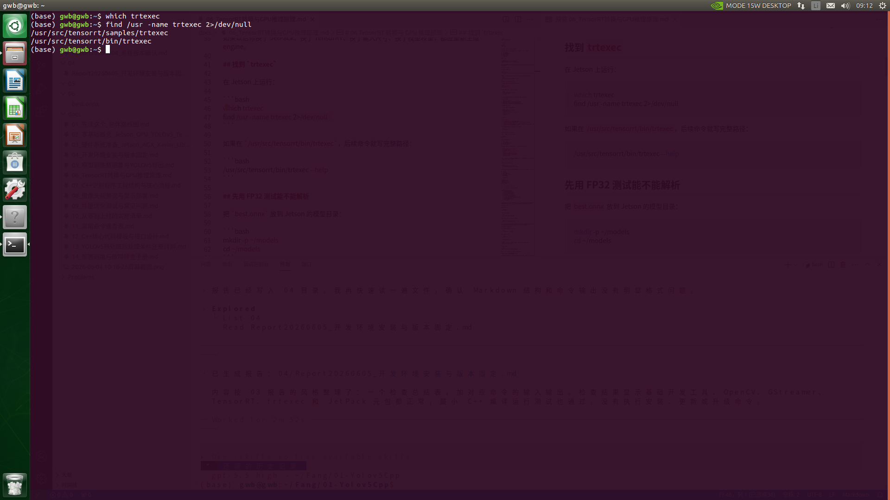
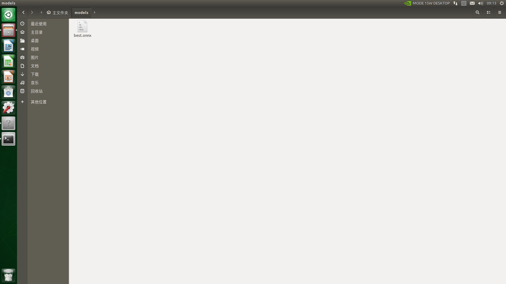
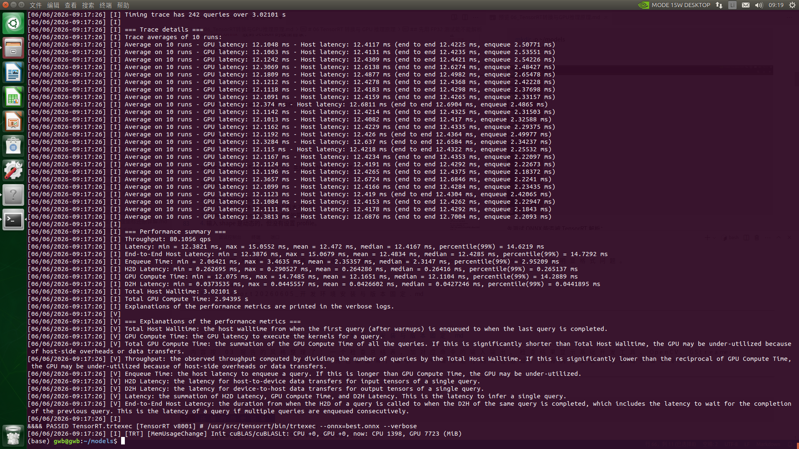
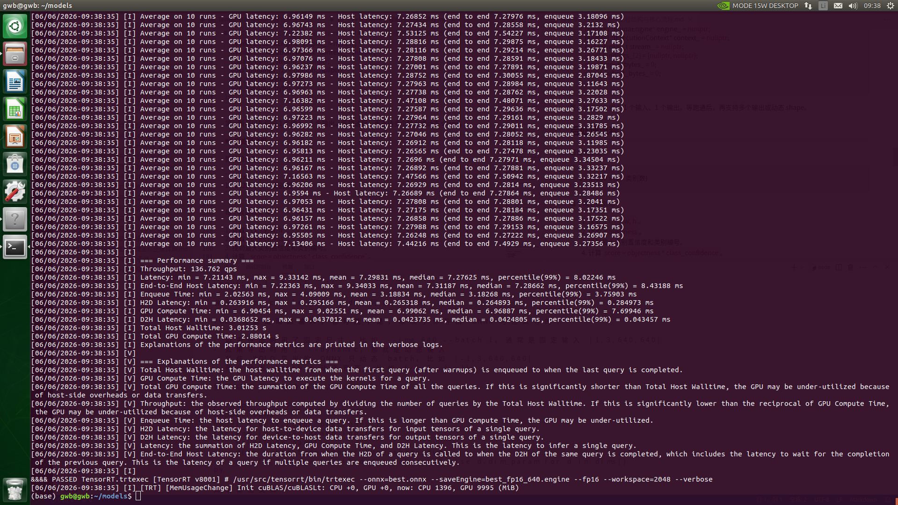

# 06 TensorRT 转换与 GPU 推理原理

这一篇讲如何把 `best.onnx` 变成 Jetson 上能高速运行的 `best.engine`。

## 为什么要转 TensorRT engine

ONNX 是通用模型格式，但它不是 Jetson 上最快的运行形式。TensorRT 会根据 Jetson AGX Xavier 的 GPU、CUDA、TensorRT 版本生成优化后的 engine。

最终部署时，C++ 程序加载的是：

```text
best_fp16_640.engine
```

而不是：

```text
best.pt
best.onnx
```

## engine 必须在 Jetson 本机生成

TensorRT engine 通常不应该跨机器复用，因为它和目标环境绑定：

1. GPU 架构。
2. TensorRT 版本。
3. CUDA 版本。
4. 输入 shape。
5. 精度模式。

正确流程：

```text
电脑或云端：best.pt -> best.onnx
Jetson 本机：best.onnx -> best.engine
```

如果以后你换了 JetPack、换了 TensorRT、换了输入尺寸、换了模型权重，都应重新生成 engine。

## 找到 `trtexec`

在 Jetson 上运行：

```bash
which trtexec
find /usr -name trtexec 2>/dev/null
```


如果在 `/usr/src/tensorrt/bin/trtexec`，后续命令就写完整路径：

```bash
/usr/src/tensorrt/bin/trtexec --help
```

## 先用 FP32 测试能不能解析

把 `best.onnx` 放到 Jetson 的模型目录：

```bash
mkdir -p ~/models
cd ~/models
```



先测试 ONNX 能否被 TensorRT 解析：

```bash
/usr/src/tensorrt/bin/trtexec \
  --onnx=best.onnx \
  --verbose
```



如果这一步失败，不要急着写 C++。先解决 ONNX 解析问题。

常见失败原因：

1. ONNX opset 太新。
2. YOLOv5 导出版本和 TensorRT 版本不兼容。
3. ONNX 里有 TensorRT 8.2 不支持的算子。
4. 输入 shape 是动态的，但没有设置 profile。

## 生成 FP16 engine

第一版建议生成 FP16 engine：

```bash
/usr/src/tensorrt/bin/trtexec \
  --onnx=best.onnx \
  --saveEngine=best_fp16_640.engine \
  --fp16 \
  --workspace=2048 \
  --verbose
```



参数解释：

| 参数 | 含义 |
| --- | --- |
| `--onnx=best.onnx` | 输入 ONNX 文件 |
| `--saveEngine=best_fp16_640.engine` | 输出 TensorRT engine |
| `--fp16` | 使用 FP16 加速 |
| `--workspace=2048` | 给 TensorRT 优化时使用的工作空间，单位通常是 MB |
| `--verbose` | 输出详细日志，便于排错 |

如果内存紧张，可以把 workspace 降低，例如：

```bash
--workspace=1024
```

## 固定 shape 和动态 shape

新手第一版建议使用固定 shape：

```text
1x3x640x640
```

固定 shape 的好处：

1. 命令简单。
2. C++ 绑定内存简单。
3. engine 更稳定。
4. 性能容易测。

如果你的 ONNX 是动态输入，需要加 shape profile。示例：

```bash
/usr/src/tensorrt/bin/trtexec \
  --onnx=best.onnx \
  --saveEngine=best_fp16_640.engine \
  --fp16 \
  --minShapes=images:1x3x640x640 \
  --optShapes=images:1x3x640x640 \
  --maxShapes=images:1x3x640x640 \
  --workspace=2048
```

其中 `images` 是输入节点名称。你的模型不一定叫这个名字，要用 Netron 或 `trtexec --verbose` 确认。

## 用 `trtexec` 简单测速

生成 engine 后可以测试：

```bash
/usr/src/tensorrt/bin/trtexec \
  --loadEngine=best_fp16_640.engine
```

这个结果只能说明 TensorRT 纯推理速度，不等于完整程序 FPS。真实 C++ 程序还包含：

1. 读图。
2. resize。
3. 颜色转换。
4. CPU 到 GPU 拷贝。
5. 后处理。
6. 显示画面。

所以要分别测：

```text
preprocess 时间
inference 时间
postprocess 时间
display 时间
```

## C++ 里 TensorRT 的基本流程

C++ 使用 TensorRT runtime 大致这样：

```text
读取 engine 文件到内存
  -> createInferRuntime
  -> deserializeCudaEngine
  -> createExecutionContext
  -> 查询输入输出 binding
  -> cudaMalloc 分配 GPU 内存
  -> 每一帧 cudaMemcpyAsync 输入
  -> context.enqueueV2 或 enqueueV3 推理
  -> cudaMemcpyAsync 输出
  -> cudaStreamSynchronize
  -> C++ 后处理
```

在 JetPack 4.x 常见的 TensorRT 8.2 环境中，很多示例仍使用 `enqueueV2`。如果你的实际 TensorRT API 有差异，以本机头文件和官方对应版本文档为准。

## 输入输出内存

假设输入是：

```text
1x3x640x640
```

输入 float 数量：

```text
1 * 3 * 640 * 640 = 1228800
```

如果 FP32 输入，每个 float 4 字节：

```text
1228800 * 4 = 4915200 字节，约 4.7 MB
```

即使 engine 是 FP16，很多模型输入仍然可以用 FP32 数据输入，TensorRT 内部会根据 engine 处理。具体输入类型要从 engine binding 查询。

## YOLOv5 输出怎么理解

常见 YOLOv5 ONNX 输出形状类似：

```text
1 x 25200 x (5 + 类别数)
```

如果类别数是 3：

```text
1 x 25200 x 8
```

每个候选框通常包含：

```text
center_x, center_y, width, height, objectness, class0_conf, class1_conf, class2_conf
```

后处理计算：

```text
score = objectness * 最大类别置信度
```

如果 `score` 大于阈值，比如 0.25，就保留。

然后做 NMS，去掉高度重叠的重复框。

注意：不同 YOLOv5 导出方式可能导致输出含义不同。第一版建议使用 Ultralytics 标准 ONNX 导出，不带 NMS，不使用额外 TensorRT YOLO 插件。这样输出更容易理解。

## NMS 是什么

模型可能对同一个目标输出多个相近的框。NMS 的作用是保留最可信的一个，删除重叠太高的其他框。

常用参数：

```text
conf_threshold = 0.25
nms_threshold = 0.45
```

调参建议：

| 问题 | 调整 |
| --- | --- |
| 漏检多 | 降低 conf_threshold |
| 误检多 | 提高 conf_threshold |
| 一个物体多个框 | 降低 nms_threshold |
| 相邻物体被合并 | 提高 nms_threshold |

## 本篇验收标准

完成本篇后，你应该有：

1. `best.onnx`。
2. `best_fp16_640.engine`。
3. `trtexec --loadEngine` 能正常跑。
4. 知道模型输入 shape。
5. 知道模型输出 shape。
6. 知道 engine 需要在 Jetson 本机生成。

## 官方资料

- NVIDIA TensorRT 8.2.5 Developer Guide：<https://docs.nvidia.com/deeplearning/tensorrt/archives/tensorrt-825/developer-guide/index.html>
- YOLOv5 模型导出：<https://docs.ultralytics.com/yolov5/tutorials/model_export/>

