# 02-2-QT入门


文章主要参考CSDN会飞的鱼-blog的文章《QT入门看这一篇就够了——超详细讲解（40000多字详细讲解，涵盖qt大量知识）》^[https://blog.csdn.net/m0_65635427/article/details/130780280]

# 一、创建QT项目

## 1-1-使用向导创建

打开Qt Creator界面

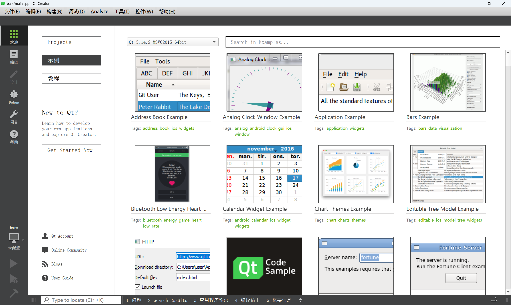

点击`New Project`>`New`

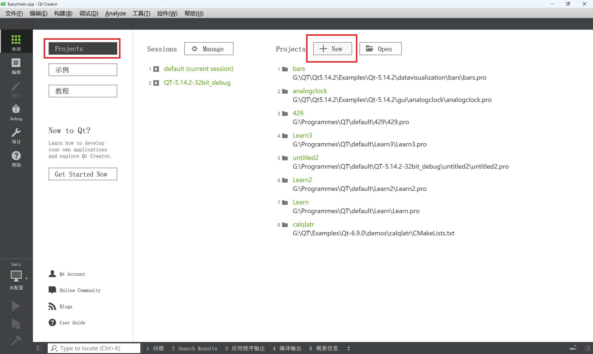

或者选择菜单栏中的`文件`>`新建文件或项目`

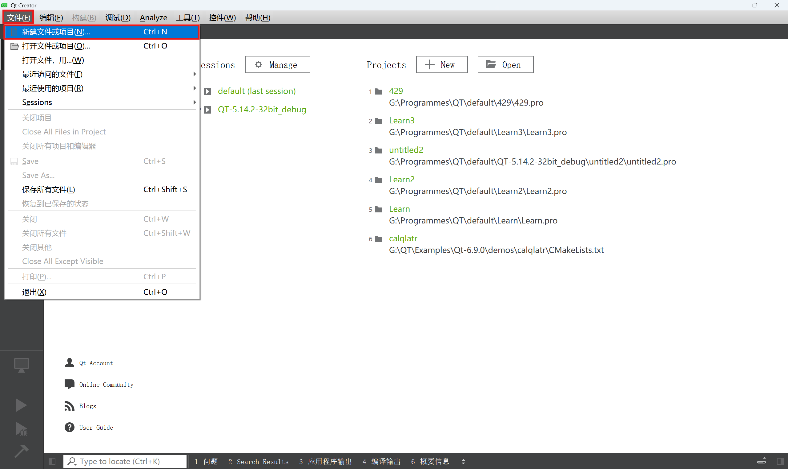

或者按下快捷键`Ctrl`+`N`

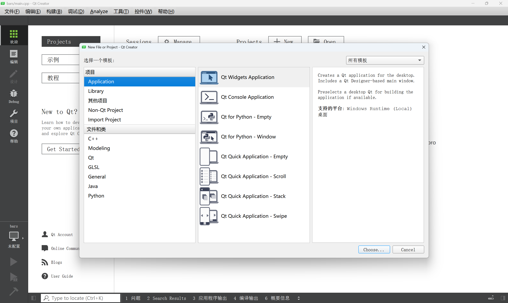

选择Qt Widgets Application

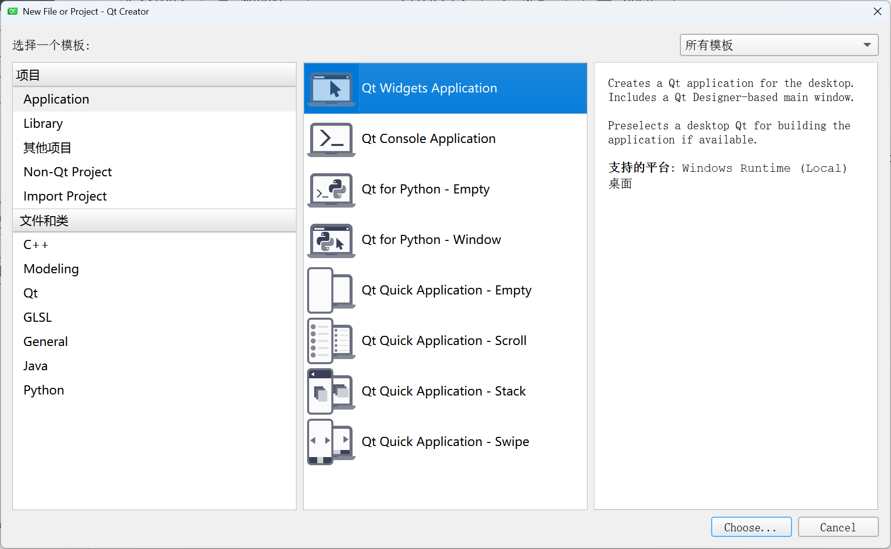

### 1-1-1-新建项目时名称和路径的注意点

填写项目名称和保存路径

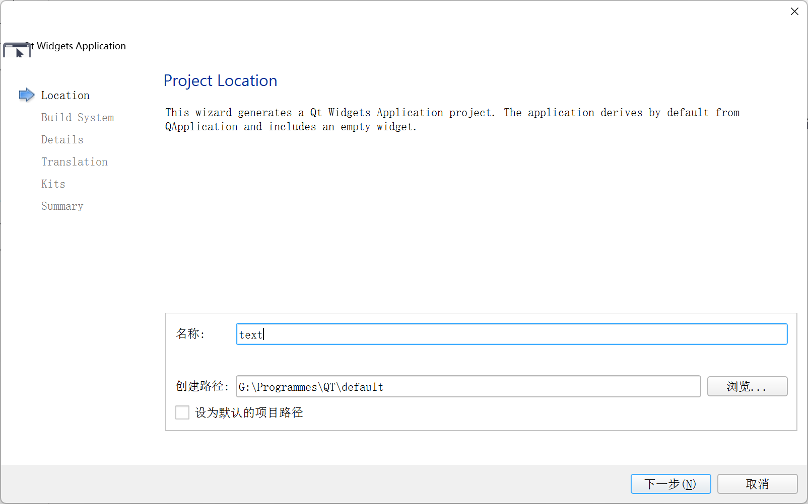

有两个注意点^[[[Qt 教程之开始的开始] —— 创建项目及注意事项_qt build system-CSDN博客](https://blog.csdn.net/maizousidemao/article/details/104152353)]

1. 项目名称不能有空格和中文
	
	01 Qt第一天
		[×] 有空格和中文
		
	01_Qt_the First Day
		[×] 有空格
		
	01_HelloWorld 
		[√] 
		
2. 路径不能有中文
	
	/home/vistar/桌面/Qt
		[×]有中文
		
	/home/vistar/desktop/Qt 
		[√]


### 1-1-2-QT编译方式qmake、CMake和Qbs的区别

选择一种编译方式

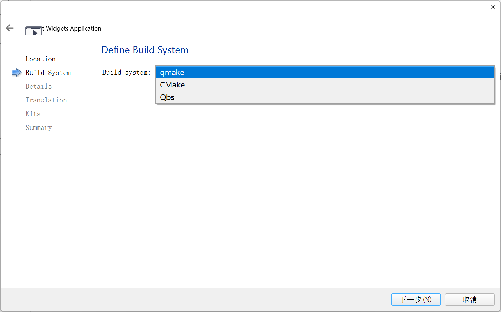

三种方式的区别如下：

可以参考官方文档[选择构建系统 |Qt Creator 文档](https://doc.qt.io/qtcreator/creator-how-to-select-build-system.html)

#### Qbs

先说Qbs，Qbs被官方废弃，Qbs与Qt Creator 4.9一起一直支持到2019年底，Qt6不支持Qbs

#### qmake

- 专注于使用Qt的项目
- QtCreator可以轻松生成项目文件(适合初学者)
- 由QtCreator支持

#### CMake

- 用于广泛的项目
- 支持多种平台和语言
- 受多个IDE支持：例如QtCreator，Visual Studio
- 生成多个IDE的项目描述
- 包含简化Qt使用的命令

总计来说CMake 很常用，功能也很强大，许多知名的项目都是用它，比如 OpenCV 和 VTK，但它的语法繁杂；qmake 是针对辅助 Qt 开发的，但也可以在非 Qt 项目使用，特点是语法简单明了，但功能也相对简单。^[[[Qt 教程之开始的开始] —— 创建项目及注意事项_qt build system-CSDN博客](https://blog.csdn.net/maizousidemao/article/details/104152353)]

**新手直接使用qmake即可**

### 1-1-3-窗口继承类QWidget、QDialog、QMainWindow 的异同点

文章主要参考CSDN 一去丶二三里的文章《QWidget、QDialog、QMainWindow 的异同点》^[[QWidget、QDialog、QMainWindow 的异同点_qdialog qwidget的区别-CSDN博客](https://blog.csdn.net/liang19890820/article/details/50533262)]

向导会默认添加一个继承自QMainWindow的类，可以在此修改类的名字和基类。默认的基类有QMainWindow、QWidget以及QDialog三个，我们可以选择QWidget（类似于空窗口），这里我们可以先创建一个不带UI的界面，继续下一步

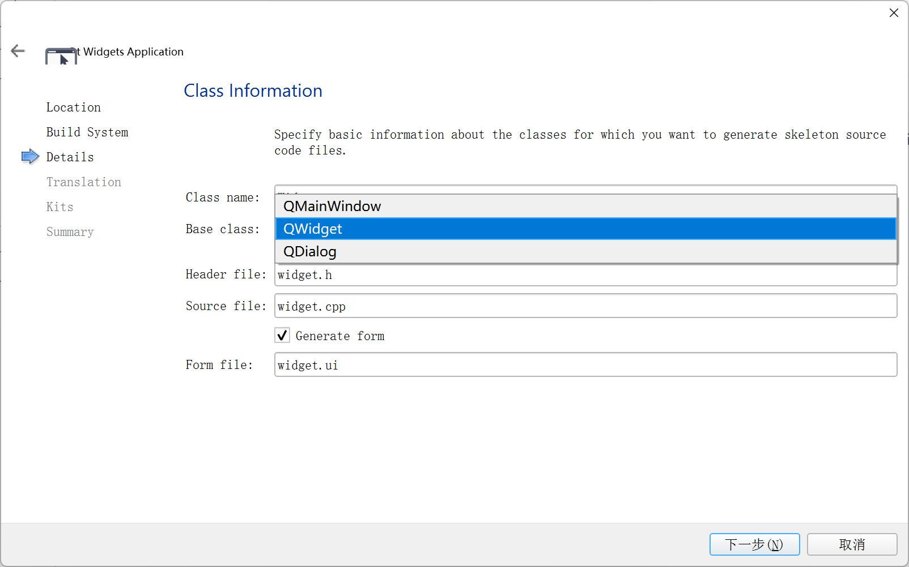

QWidget继承于QObject和QPaintDevice，QDialog和QMainWindow则继承于QWidget，QDialog、QMainWindow两者之间没有直接关系。

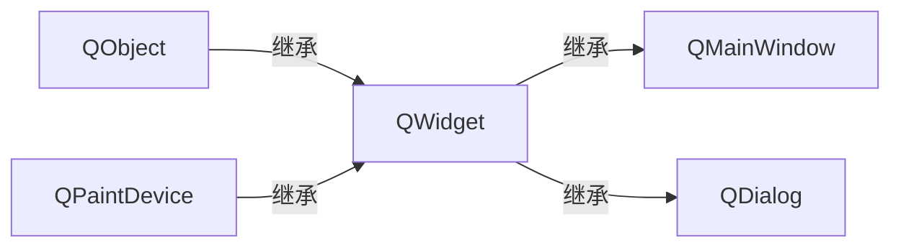

#### QWidget

QWidget类是所有用户界面对象的基类。

窗口部件是用户界面的一个原子：它从窗口系统接收鼠标、键盘和其它事件，并且将自己的表现形式绘制在屏幕上。每一个窗口部件都是矩形，并且它们按Z轴顺序排列。一个窗口部件可以被它的父窗口部件或者它前面的窗口部件盖住一部分。

QWidget有很多成员函数，但是它们中的一些有少量的直接功能：例如，QWidget有字体属性，但是自己从来不用。为很多继承它的子类提供了实际的功能，比如QLabel、QPushButton、QCheckBox等等。

没有父窗体的小部件始终是一个独立的窗口（顶级窗口部件）。非窗口的小部件为子部件，它们在父窗口中显示。Qt中大多数部件主要被用作子部件。例如：可以显示一个按钮作为顶层窗口，但大多数人更喜欢将按钮内置于其它部件，如QDialog。

#### QDialog

QDialog类是对话框窗口的基类。

对话框窗口是一个顶级窗体，主要用于短期任务以及和用户进行简要通讯。QDialog可以是模式的也可以是非模式的。QDialog支持扩展性并且可以提供返回值。它们可以有默认按钮。QDialog也可以有一个QSizeGrip在它的右下角，使用setSizeGripEnabled()。

注意：QDialog（以及其它使用Qt::Dialog类型的widget）使用父窗口部件的方法和Qt中其它类稍微不同。对话框总是顶级窗口部件，但是如果它有一个父对象，它的默认位置就是父对象的中间。它也将和父对象共享工具条条目。

##### 模式对话框
阻塞同一应用程序中其它可视窗口输入的对话框。模式对话框有自己的事件循环，用户必须完成这个对话框中的交互操作，并且关闭了它之后才能访问应用程序中的其它任何窗口。模式对话框仅阻止访问与对话相关联的窗口，允许用户继续使用其它窗口中的应用程序。

显示模态对话框最常见的方法是调用其exec()函数，当用户关闭对话框，exec()将提供一个有用的返回值，并且这时流程控制继续从调用exec()的地方进行。通常情况下，要获得对话框关闭并返回相应的值，我们连接默认按钮，例如："确定"按钮连接到accept()槽，"取消"按钮连接到reject()槽。另外我们也可以连接done()槽，传递给它Accepted或Rejected。

##### 非模式对话框
和同一个程序中其它窗口操作无关的对话框。在文字处理中的查找和替换对话框通常是非模式的，允许用户同时与应用程序的主窗口和对话框进行交互。调用show()来显示非模式对话框，并立即将控制返回给调用者。

如果隐藏对话框后调用show()函数，对话框将显示在其原始位置，这是因为窗口管理器决定的窗户位置没有明确由程序员指定，为了保持被用户移动的对话框位置，在closeEvent()中进行处理，然后在显示之前，将对话框移动到该位置。

##### 半模式对话框
调用setModal(true)或者setWindowModality()，然后show()。有别于exec()，show() 立即返回给控制调用者。

对于进度对话框来说，调用setModal(true)是非常有用的，用户必须拥有与其交互的能力，例如：取消长时间运行的操作。如果使用show()和setModal(true)共同执行一个长时间操作，则必须定期在执行过程中调用QApplication::processEvents()，以使用户能够与对话框交互（可以参考QProgressDialog）。

#### QMainWindow

QMainWindow类提供一个有菜单条、工具栏、状态条的主应用程序窗口。

一个主窗口提供了构建应用程序的用户界面框架。Qt拥有QMainWindow及其相关类来管理主窗口。

QMainWindow拥有自己的布局，我们可以使用QMenuBar（菜单栏）、QToolBar（工具栏）、QStatusBar（状态栏）以及QDockWidget（悬浮窗体），布局有一个可由任何种类小窗口所占据的中心区域。

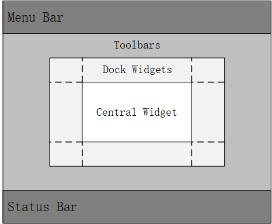

语言可以先不选

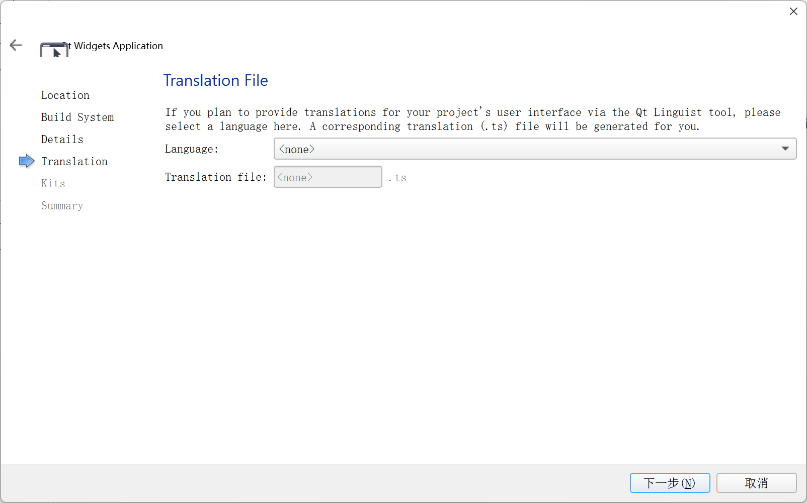

选择编译套件

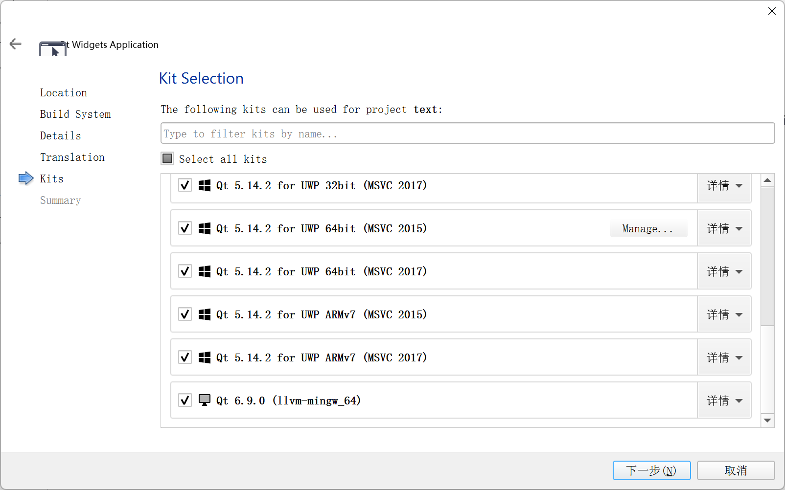

添加版本控制

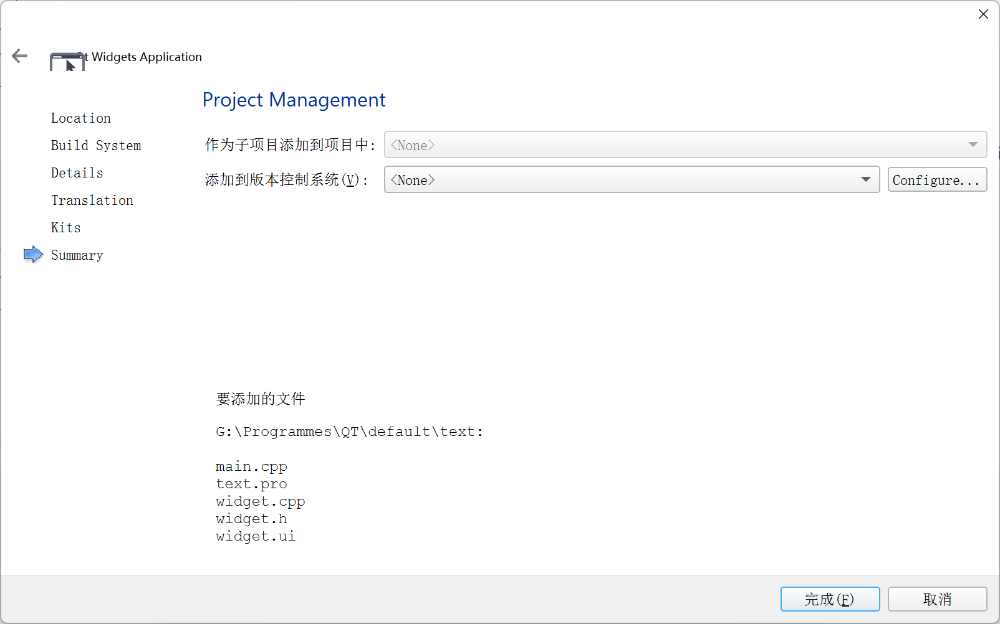

创建成功

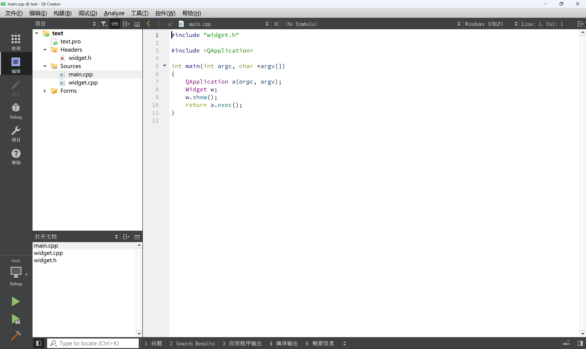

## 1-2-一个最简单的Qt应用程序

生成项目后默认生成的代码

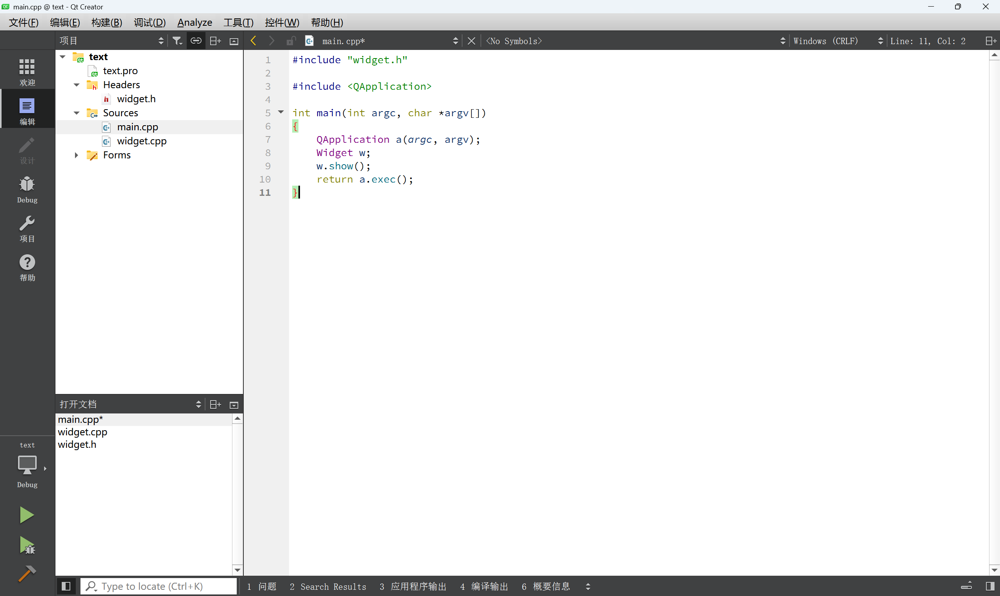

```cpp
#include "widget.h"
#include <QApplication>

int main(int argc, char *argv[Alt])
{
    QApplication a(argc, argv);
    Widget w;
    w.show();
    return a.exec();
}
```

#### 对代码逐句解释

##### `#include "widget.h"`

- **作用** ：这是一个预处理指令，用于包含名为 `widget.h` 的头文件。这个头文件中通常定义了一个名为 `Widget` 的自定义类，该类继承自 `QWidget` 类（或者其他 Qt 的窗口类），它包含了应用程序主窗口的用户界面元素和相关功能的声明。
    
- **示例说明** ：在 `widget.h` 中定义了类 `Widget` 的成员变量、函数声明等，比如窗口中的按钮、标签等控件的声明以及相应的槽函数声明等，在 `main` 函数中通过包含这个头文件，就可以使用 `Widget` 类来创建窗口对象。

##### widge.h文件

`widget.h`是下面这个文件

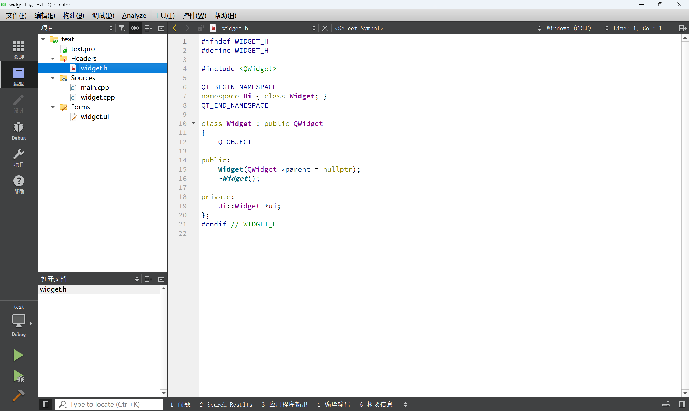

代码如下

```cpp
#ifndef WIDGET_H
#define WIDGET_H

#include <QWidget>

QT_BEGIN_NAMESPACE
namespace Ui { class Widget; }
QT_END_NAMESPACE

class Widget : public QWidget
{
    Q_OBJECT

public:
    Widget(QWidget *parent = nullptr);
    ~Widget();

private:
    Ui::Widget *ui;
};
#endif // WIDGET_H
```

这段代码定义一个继承自 `QWidget` 的 `Widget` 类

###### `#ifndef WIDGET_H` 和 `#define WIDGET_H`

- **作用** ：这两行代码是预处理器指令，用于防止该头文件被重复包含。当头文件被第一次包含时，`#ifndef WIDGET_H` 判断宏 `WIDGET_H` 是否未定义，如果是，则定义该宏（通过 `#define WIDGET_H`）并编译头文件中的代码。如果该头文件再次被包含，`#ifndef WIDGET_H` 判断宏 `WIDGET_H` 已经被定义，就会跳过头文件中后续的代码，避免重复定义类等编译错误。
    
- **重要性** ：这是 C++ 编程中常见的头文件保护机制，防止在复杂的项目中由于头文件的多次包含而导致的编译问题。

###### `#include <QWidget>`

- **作用** ：包含 Qt 的 `QWidget` 类的头文件。`QWidget` 是所有用户界面对象的基类，提供了基本的窗口系统、绘图和事件处理功能。`Widget` 类继承自 `QWidget`，因此需要包含这个头文件来使用 `QWidget` 的功能和属性。
    
- **关联性** ：`Widget` 类依赖于 `QWidget` 类来实现其窗口功能，通过继承可以获得 `QWidget` 的所有公有成员函数和信号槽机制等特性。


###### `QT_BEGIN_NAMESPACE` 和 `QT_END_NAMESPACE`

- **作用** ：这两个宏是 Qt 提供的，用于处理 Qt 的命名空间问题。在不同的编译器和环境下，Qt 的类和函数可能被放置在不同的命名空间中。`QT_BEGIN_NAMESPACE` 和 `QT_END_NAMESPACE` 用于包围 Qt 的代码，使得这些代码在不同的命名空间配置下能够正确地被编译和使用。
    
- **背景** ：Qt 支持将类和函数放在一个命名空间中以避免命名冲突，但默认情况下是不使用命名空间的。这两个宏主要用于在生成文档和处理一些特殊编译器配置时发挥作用，对于普通的应用程序开发来说，通常不需要特别关注它们的具体实现。
    

###### `namespace Ui { class Widget; }`

- **作用** ：声明了一个命名空间 `Ui`，并在该命名空间中声明了一个名为 `Widget` 的类。这个 `Widget` 类通常是通过 Qt 的用户界面设计器（Qt Designer）生成的 UI 文件（.ui 文件）对应的类，它包含了窗口的用户界面元素（如按钮、标签、布局等）的声明。
    
- **关联性** ：在使用 Qt Designer 设计用户界面时，Qt 会自动生成一个与 UI 文件对应的 C++ 头文件（通常在编译过程中生成），其中定义了 `Ui::Widget` 类，该类包含了一系列的成员变量，用于表示界面中的各个控件。`Widget` 类通过包含这个自动生成的头文件，并在其实现中使用 `Ui::Widget` 类来初始化和管理界面元素。
    

###### `class Widget : public QWidget`

- **作用** ：声明了一个名为 `Widget` 的类，它继承自 `QWidget` 类。通过继承，`Widget` 类可以获得 `QWidget` 的基本功能，并且可以添加自定义的成员变量、成员函数、信号和槽等，以实现特定的应用程序功能。
    
- **继承的意义** ：继承是面向对象编程的重要特性之一，它允许 `Widget` 类重用 `QWidget` 的代码，并且可以根据需要覆盖或扩展基类的行为。例如，`Widget` 类可以重写 `paintEvent` 函数来自定义窗口的绘制行为，或者添加新的槽函数来处理自定义的信号。
    

###### `Q_OBJECT`

- **作用** ：这是一个非常重要的宏，必须出现在使用 Qt 的信号和槽机制以及元对象系统的类的定义中。`Q_OBJECT` 宏会指示 Qt 的元对象编译器（moc，Meta - Object Compiler）为该类生成额外的代码，这些代码提供了信号和槽的实现、运行时类型信息、对象名等元数据。
    
- **关键功能** ：
    
    - **信号和槽支持** ：使得类可以定义信号（signals）和槽（slots），这是 Qt 的核心组件之间通信机制。例如，当用户点击按钮时，按钮可以发出一个信号，而 `Widget` 类中的一个槽函数可以连接到这个信号，从而在按钮点击时执行相应的操作。
        
    - **翻译支持** ：支持多语言翻译，可以方便地将应用程序本地化为不同的语言。
        
    - **其他特性** ：还支持定时器事件、自定义事件处理等特性，增强了类的功能和灵活性。
        

###### 公共部分

- **`Widget(QWidget *parent = nullptr);`** ：
    
    - **作用** ：这是 `Widget` 类的构造函数声明。它接受一个指向 `QWidget` 的指针作为参数，该参数表示父窗口部件。在 Qt 中，窗口部件可以有父子关系，父窗口部件负责管理子窗口部件的生命周期和布局等。
        
    - **默认参数** ：`nullptr` 是 C++ 11 中的 nullptr_t 类型，表示空指针。构造函数的参数 `parent` 有一个默认值 `nullptr`，这意味着当创建 `Widget` 对象时，可以不指定父窗口部件，此时该对象没有父窗口部件。
        
    - **用途** ：构造函数用于初始化 `Widget` 对象，在创建对象时会调用该函数，并且可以将父窗口部件传递给它，以便建立父子关系。例如，在主函数中创建 `Widget` 对象时，如果没有指定父窗口部件，那么它可以作为一个独立的窗口存在。
        
- **`~Widget();`** ：
    
    - **作用** ：这是 `Widget` 类的析构函数声明。析构函数在对象生命周期结束时被调用，用于清理和释放对象所占用的资源，如关闭文件、释放内存等。
        
    - **重要性** ：在 C++ 中，正确地实现析构函数是确保资源管理安全的重要部分。对于 `Widget` 类来说，析构函数可能会负责清理其内部的子窗口部件、断开信号和槽的连接等操作，以确保程序的稳定运行。
        

###### 私有部分

- **`Ui::Widget *ui;`** ：
    
    - **作用** ：这是一个指向 `Ui::Widget` 类型的指针，用于存储通过 Qt Designer 设计的用户界面元素。`Ui::Widget` 类是在 UI 文件编译时自动生成的，它包含了一系列的成员变量，每个变量对应界面中的一个控件。
        
    - **用途** ：在 `Widget` 类的实现中，通常会在构造函数中调用 `ui - > setupUi(this)` 方法来初始化界面元素，将设计好的界面加载到当前窗口中。然后可以通过 `ui` 指针来访问和操作界面中的各个控件，例如设置控件的文本、连接信号和槽等。
        
    - **生命周期** ：`ui` 指针在 `Widget` 对象的构造过程中被分配内存，并在析构过程中释放内存，以确保资源的正确管理。
        

这个头文件定义了一个基本的 `Widget` 类，用于创建一个继承自 `QWidget` 的窗口部件，结合了 Qt 的信号和槽机制、元对象系统以及通过 Qt Designer 设计的用户界面，是构建 Qt 应用程序中自定义窗口的基础。


##### `#include <QApplication>`

- **作用** ：包含 Qt 的 `QApplication` 类的头文件。`QApplication` 是 Qt 应用程序的控制中心，它管理着应用程序的控制流和主要设置，每一个基于 Qt 的 GUI 应用程序都必须包含一个 `QApplication` 对象。
    
- **关键功能** ：
    
    - **事件循环管理** ：负责启动和管理事件循环，事件循环是应用程序运行时的核心机制，它不断监听和分发各种事件（如鼠标点击、键盘输入、窗口缩放等）到相应的窗口部件进行处理。
        
    - **资源管理** ：管理应用程序的资源，如字体、图标、翻译文件等，还负责处理应用程序的命令行参数等。
        

##### `int main(int argc, char *argv[Alt])`

- **作用** ：这是 C++ 程序的入口点函数，每个程序的执行都从 `main` 函数开始。`argc` 是命令行参数的个数，`argv` 是指向命令行参数字符串的指针数组，用于向程序传递启动参数。
    
- **示例说明** ：比如在命令行中运行程序时，可以通过 `argv` 传递一些参数来指定程序的初始状态或行为等，程序可以通过解析 `argc` 和 `argv` 来获取这些参数并进行相应的处理。
    

##### `QApplication a(argc, argv);`

- **作用** ：创建一个 `QApplication` 对象 `a`，并将其初始化为命令行参数 `argc` 和 `argv`。这个对象是应用程序的核心，它负责初始化应用程序的环境，包括设置应用程序的名称、组织名称等信息，并且为后续的事件循环做好准备。
    
- **重要性** ：在 Qt 应用程序中，必须且只能有一个 `QApplication` 对象，它是整个应用程序的基础，所有与应用程序相关的操作（如窗口显示、事件处理等）都离不开这个对象。
    

##### `Widget w;`

- **作用** ：创建一个 `Widget` 类的对象 `w`，这个对象就是应用程序的主窗口。`Widget` 类是在 `widget.h` 中定义的，它继承自 `QWidget` 类，具有 `QWidget` 的基本属性和方法，并且可以添加自定义的控件、布局和功能等。
    
- **示例说明** ：如果在 `Widget` 类中定义了一个按钮和一个标签，并且为按钮连接了相应的槽函数，那么创建 `Widget` 对象后，这些控件和功能就会被实例化并准备显示在窗口中。
    

##### `w.show();`

- **作用** ：调用 `Widget` 对象 `w` 的 `show()` 函数，使该窗口在屏幕上显示出来。在 Qt 中，窗口部件（如窗口、控件等）默认是隐藏的，只有通过调用 `show()` 函数或者类似的显示函数（如 `showMaximized()` 等），它们才会在屏幕上可见。
    
- **显示过程** ：`show()` 函数会触发一系列的绘制和显示操作，包括窗口的创建、布局调整、控件的渲染等，最终将窗口呈现给用户。
    

##### `return a.exec();`

- **作用** ：调用 `QApplication` 对象 `a` 的 `exec()` 函数，进入事件循环。事件循环是应用程序运行的关键部分，它会使应用程序处于等待状态，不断地监听和处理各种事件，如用户的输入事件、系统事件等，直到应用程序关闭。
    
- **返回值** ：`exec()` 函数会返回一个整数值，通常情况下，当应用程序正常退出时返回 0。这个返回值可以被操作系统的 shell 或其他调用该程序的实体捕获，用于判断程序的执行状态。
    

这段代码整体上就是一个简单的 Qt Widgets 应用程序的启动流程，它创建了一个应用程序对象和一个主窗口对象，显示主窗口并进入事件循环，等待用户的操作和事件的发生，从而实现应用程序的运行。

**注意点**

	1.Qt系统提供的类头文件没有.h后缀
	
	2.Qt一个类对应一个头文件，类名和头文件名一致
	
	3.QApplication应用程序类

管理图形用户界面应用程序的控制流和主要设置。

是Qt生命，一个程序要确保一直运行，就肯定至少得有一个循环，这就是Qt主消息循环，在其中完成来自窗口系统和其它资源的所有事件消息处理和调度。它也处理应用程序的初始化和结束，并且提供对话管理。

对于任何一个使用Qt的图形用户界面应用程序，都正好存在一个QApplication 对象，不论这个应用程序在同一时刻有多少个窗口。

1. a.exec()

程序进入消息循环，等待对用户输入进行响应。这里main()把控制权转交给Qt，Qt完成事件处理工作，当应用程序退出的时候exec()的值就会返回。在exec()中，Qt接受并处理用户和系统的事件并且把它们传递给适当的窗口部件。