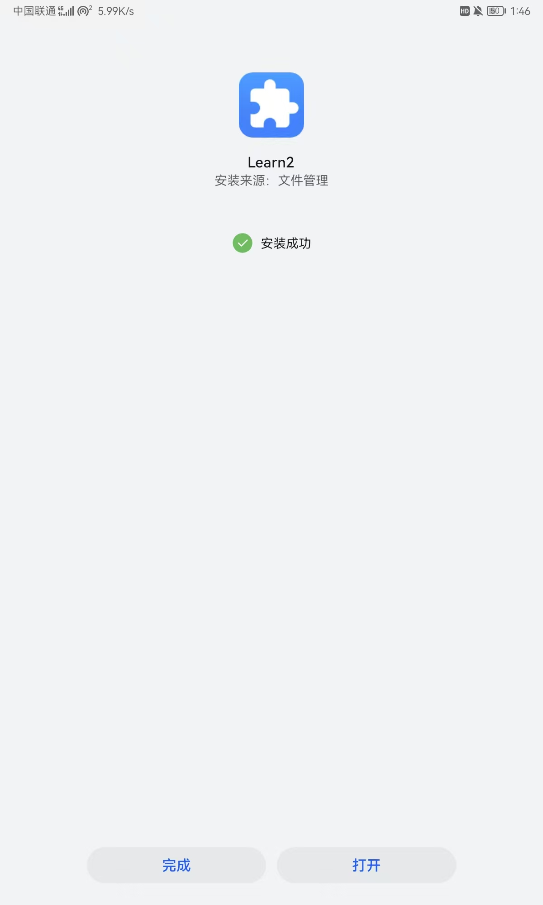
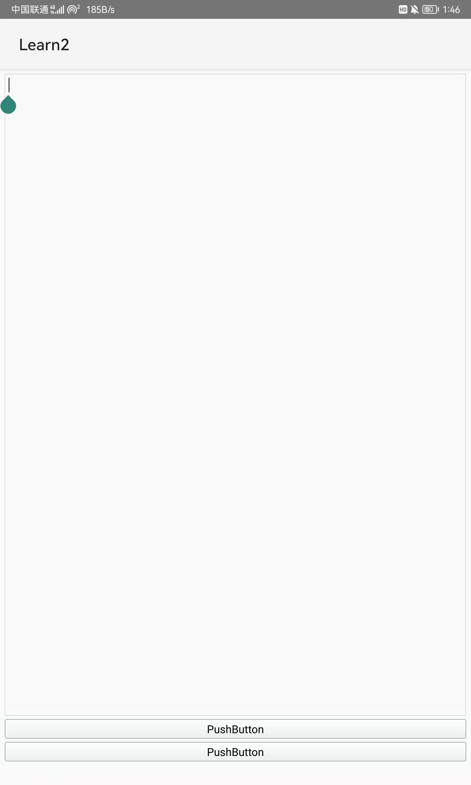

# 03-2-QT打包为APK

文章主要参考CSDN雪豹不会梦到瑞克5的文章《QT----写完的程序打包为APK在自己的手机上运行》^[https://blog.csdn.net/szn1316159505/article/details/136458920]

# 一、qt安装android组件

qtcreater–工具-QTMaintenaceTool-startMaintenaceTool—登陆—添加或修改组件—找到android，安装
若是没有android这个包，就吧右边全勾上，筛选一下就会出现了


# 二、打开qt配置Android 环境

打开qtcreater–工具-外部-配置，配置android的sdk、ndk，选择路径下载等，让下边全绿


此时配置项目中会出现Android选项


点击`SDK管理器`


将ARM架构的包选上安装


在设备中添加


设置


**出现错误**

```
Exception in thread "main" javax.net.ssl.SSLHandshakeException: PKIX path building failed: sun.security.provider.certpath.SunCertPathBuilderException: unable to find valid certification path to requested target
```


找到需要的gradle版本


使用
[03-2-1-手动安装Gradle](Note/QT/03-2-1-手动安装Gradle.md)
[03-2-2-javax.net.ssl.SSLHandshakeException：PKIX path building failed问题的解决](Note/QT/03-2-2-javax.net.ssl.SSLHandshakeException：PKIX%20path%20building%20failed问题的解决.md)
中的方法问题得到解决

软件正常安装






---
#QT #打包 #apk